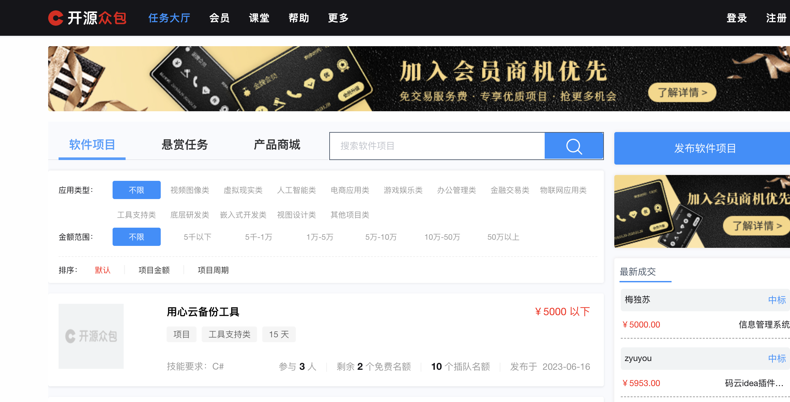
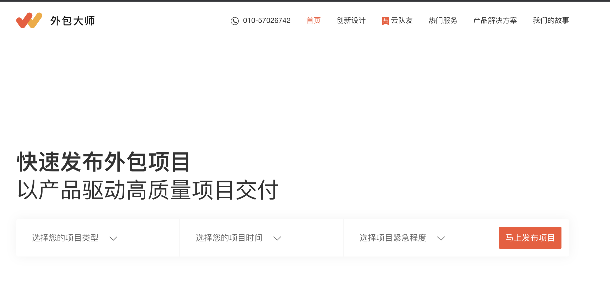
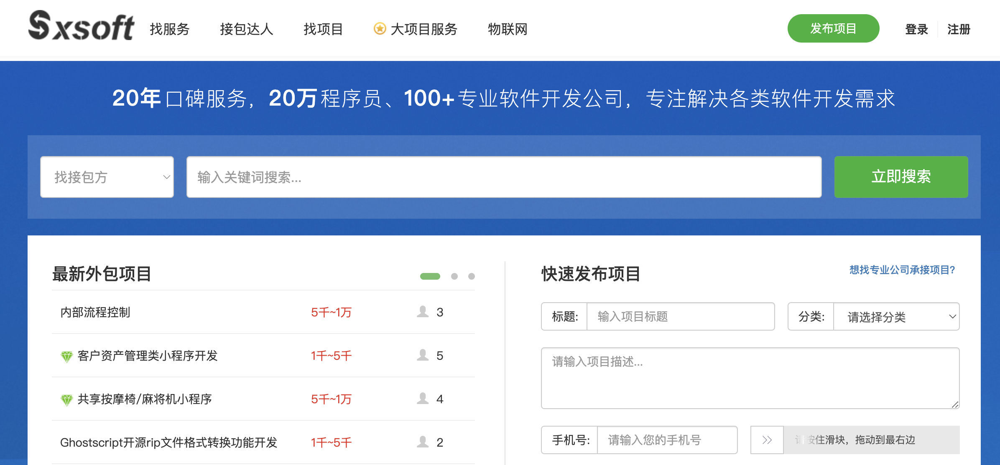

# 程序员接单大全

:::tip
注意：以下介绍的仅仅是可以接单的渠道，而不是给你讲如何能接到单，如果快速赚钱
:::

## 媒体平台

媒体平台推荐抖音和小红书，推荐抖音的理由是抖音的流量最大，你可以把抖音作为宣传的第一平台，推荐小红书的理由是小红书以图文为主，相对于做短视频来说门槛要低一些，另外就是小红书的人群质量挺高

## 聊天软件

聊天软件毫无疑问，肯定是 QQ 和微信了, 微信群没法搜索，你可以先从 qq 群开始，先搜索一些群加进去再说，慢慢积累

## 电商平台

电商平台主要推荐淘宝，万能的淘宝，这句话不是吹牛的，去淘宝开个个人软件开发的小店，听说做得好的，一年能挣一两百个 w

## 独立平台

### 国内

1.程序员客栈 [https://www.proginn.com/](https://www.proginn.com/)

2.码市 [https://codemart.com/](https://codemart.com/)

3.开源众包 [https://zb.oschina.net](https://zb.oschina.net)

4.boss 直聘，去搜兼职/远程/软件外包等关键字

5.猪八戒 [https://zbj.com](https://zbj.com)

:::tip

注意：这里的单以公司身份接应该比较好

:::

6.开发邦 [https://www.kaifabang.com/](https://www.kaifabang.com/)

7.猿急送 [https://www.yuanjisong.com/](https://www.yuanjisong.com/)

8.英选 [https://www.yingxuan.co/](https://www.yingxuan.co/)

9.码易 [https://www.mayigeek.com/](https://www.mayigeek.com/)

10.外包大师 [http://www.waibaodashi.com/](http://www.waibaodashi.com/)

11.解放号 [https://www.jfh.com/](https://www.jfh.com/)

12.实现网 [https://shixian.com/](https://shixian.com/)

13.sxsoft [https://www.sxsoft.com/](https://www.sxsoft.com/)

14.一品威客 [https://www.epwk.com/](https://www.epwk.com/)

15.自由职客 [https://www.freekeer.com/](https://www.freekeer.com/)

### 国外

国外的后面再收集，持续更新
