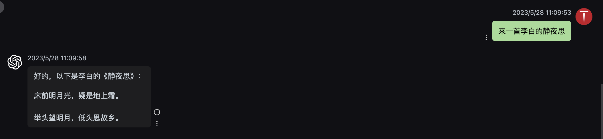
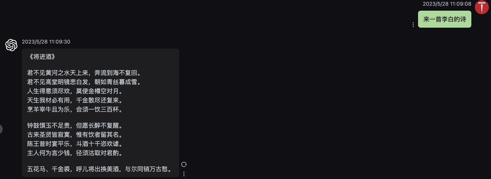
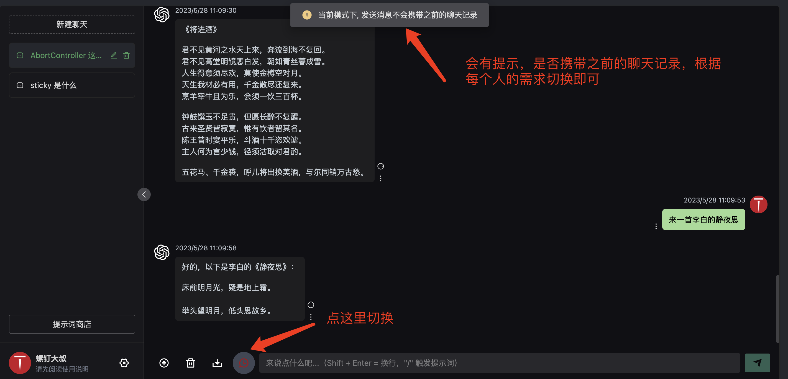

# 国内稳定版 GPT 使用指南

:::tip

抖音：螺钉大叔

微信：niuma_top

:::

## 免费教程

即将推出《ChatGPT 入门指南》，这套教程将完全免费开源，以文档为主，短视频为辅，每天分享 ChatGPT 的使用技巧，和别的短视频不同的是，这套教程将是成体系的，在教程里面，将会讲解账号注册到稳定使用的细节，欢迎持续关注，抖音搜索：螺钉大叔，私聊我拉你入抖音群

## 稳定使用

想要稳定使用，白嫖肯定是不行的，特么的官方都是 20 美金一个月，谁这么有钱付费开账号然后免费给你用？另外，目前来说，国内没有任何个人或者小团队能够开发出 ChatGPT 这种效果的大模型，就连 BAT 这些大厂都还在追赶，因此，不要被割韭菜，基于 GPT 的应用基本上都是去调用的官方的 API，如果你懂开发的话，也就是发 http 请求，给你返回大模型处理好的数据(如果不懂，这句话可以跳过)，说这个就是希望你能明白，客户端不重要，其实就是一个界面而已，这种客户端有非常多开源的，我们这个客户端就是使用的开源项目（ChatGPT-Next-web）

有了客户端，你要想使用，还需要一个 key 能连接到 OpenAI 的官网，这个 key 又必须要先注册账号，才能生成这个 key，这个在国内是不方便操作的，而且不稳定，就算是你会魔法，也会经常掉线，有时候还会封号，最近，国内很多付费用户已经被大规模封号了，为了解决这个问题，比较好的办法就是有稳定的服务器做一层代理，这层代理需要买服务器，需要有人维护，给你提供服务，肯定是要收费的，所有的代理服务商赚钱都是这种模式，类似于中间商赚差价

以上给你讲的这些属于底层原理了，了解了这个，你就应该明白，那些帮你代充费用的，那些淘宝上卖共享账号的，为啥使用起来有风险不稳定，最根本的原因是官方的限制，即时你搞到了账号，也容易封号，而中间的代理服务商，是以公司的名义和 OpenAI 对接，类似于你是阿里云的代理服务商一样，你想想阿里云会不会把它的合作伙伴给封了

# 计费说明

chatgpt 官方的网页版是免费/付费包月模式，普通用户其实不用关系 token，但是如果你是开发者，去调用官方的 API 来开发应用，你就必须了解 token，因为 API 是基于 token 收费的

token 其实并不贵，我们代理出去，中间做一次中转，按照 p 点来计费，关于 p 点的直观概念，举个例子：

让 gpt 写一首李白的诗：消耗 2p，意味着 10000p 可以写 5000 首类似长度的诗，目前，10000p 目前的费用是 40 元



让 gpt 写一首李白的将进酒，这首诗比静夜思内容长度更长，消耗掉 4p，意味着 10000p 你可以写 2500 首类似长度的诗



如果你让他写 500 字的小作文，消耗掉 8p，意味着 10000p，你可以写 1250 篇小作文

## 使用成本

官方 chatgpt 的费用诗 20 美金包月，换算成人民币 140 元左右，购买成 p 点，可以购买 3 万 5 千点，如果是普通的编程学习问 gpt 相关问题，根本用不完这么多点数，就有点浪费了

通过 api 的方式，一般一个月用几十块钱的 p 点基本上能满足了，这是性价比比较高的方式

## 查询余额

第 1 步：

点设置 --> 高级设置 --> 把你获取到的 key 填进去

第 2 步：

点下方输入框左侧第一个按钮，可以即可查询当前 key 的余额，默认体验余额 100 点

## 历史记录是很贵的

如果使用过官方的 chatgpt 网页版，你会发现它能记住你前面问的问题，这其实是假象，这种聊天大模型是根本记不住你前面说的话的，他要理解你说的信息，需要你把聊天的上下文全部发送给他，举个例子：

```
问： 我想吃鱼香肉丝，请告诉我做这道菜的具体步骤：
答：.... 这里省略
问：我上一个问题问的是什么？
答：我想吃鱼香肉丝，请告诉我做这道菜的具体步骤
```

这里我进行了 2 轮提问，我们发送请求的内容和回复是这样的：

第一次提问：

```
问： 我想吃鱼香肉丝，请告诉我做这道菜的具体步骤：
答：.... 这里省略
```

第二次提问：

```
问： 我想吃鱼香肉丝，请告诉我做这道菜的具体步骤：
答：.... 这里省略
问：我上一个问题问的是什么？
答：我想吃鱼香肉丝，请告诉我做这道菜的具体步骤
```

发现了么，第二次提问，gpt 能记住你前面说的话，是因为我们把第一次提问的内容发送给它了，这样它才能理解，这个就是我们说的历史上下文

```
如果你要让gpt理解你前面说的话，这意味着你需要消耗掉更多的p点
```

基于这个原因，所以说历史记录比较贵，对于使用 gpt 来提升开发效率，如果是解决 bug 或者是让 gpt 帮你讲解你不懂的代码，其实没有必要带上上下文，这样消耗的 p 点就会更少，这个在我们这个应用里面可以设置



## 充值和费用

目前支持的 p 点充值分为 3 档

```
5元   1000p（1千p点）
40元  10000p（1万p点）
350元 100000p (10万p点)
```

注意：p 点充值后不可以退款，因为我们充值到了 open ai，我也退不了，建议少量充值，如果使用顺畅，可以每次 1 万 p 点为单位充值

## 开发者计划

我们目前正在开发一个开发者平台，你可以批量采购 p 点，然后自己开发应用，赚外快

开通开发者权限，p 点采购价格如下：

```
4元   1000p（1千p点）
35元  10000p（1万p点）
300元 100000p (10万p点)
```

开通开发者权限的条件，一次性充值 12 万 p 点，即

```
10万：350元
2万：80元
总计：350+80元
```

你的账户里面如果有 430 元的 p 点，可以找我开通开发者权限，有了这个权限，你可以申请 key，把 key 拿去销售，这里销售不管你是在淘宝还是抖音销售都可以，这个和目前淘宝平台的带开通账号、代充值是不一样的，我们这种 API 的方式更安全和稳定

一种比较好的变现模式是，你可以做一些免费的 gpt 应用，让软件免费，通过 key 来收费

## 关于 GPT4

我们的 key 是开通了 gpt-4 权限的，由于 gpt-4 成本比较高，通常使用成本是 3.5 模型的 15-60 倍，举个例子，gpt-4 8K 一次请求的消耗上限是 2400P，通常来说，一次 GPT-4 的请求消耗会在几百 P 到上千 P，这意味着你使用 gpt4 模型，一次请求可能就会消耗几块钱，经过我这几个月的使用来看，gpt3.5 对于编程来说暂时已经够用了，性价比也是比较高的

基于上面的原因，目前我们这个项目没有支持 gpt-4，但是我们 key 是支持 gpt4 模型的，如果有需要，可以在这个项目上做二次开发，或者自己独立开发新系统
