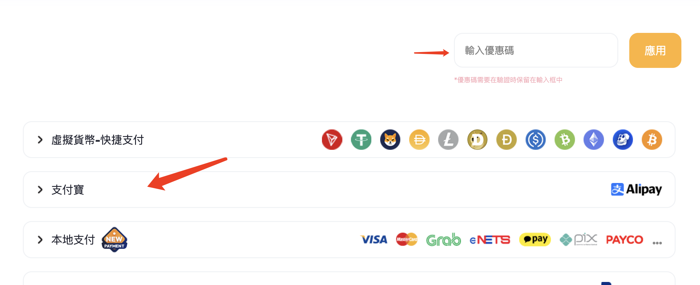
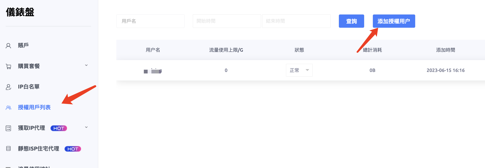
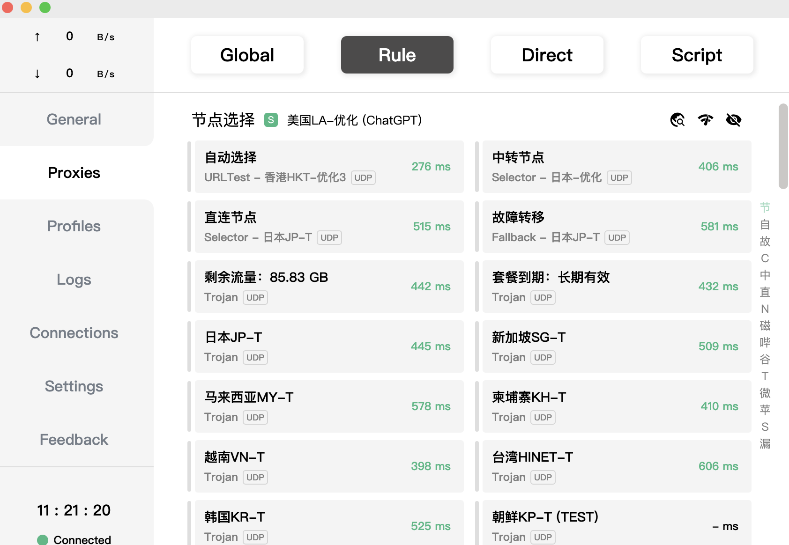
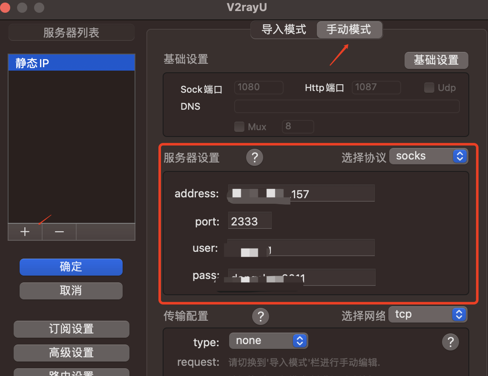
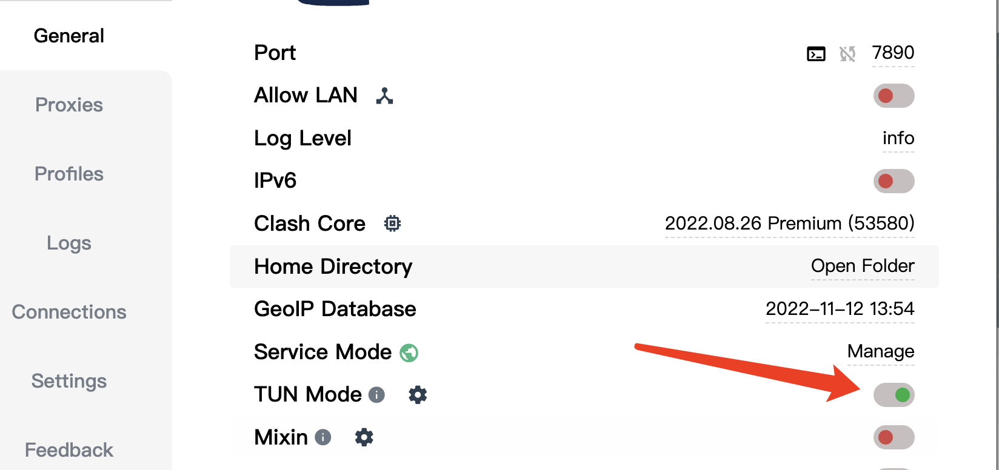

# 静态住宅 IP

## 如何检测是否是静态住宅 IP？

点击进入这个网站：[ipinfo.io](https://ipinfo.io/)


如果出现 type 为 isp，说明为静态住宅 IP，如果出现的是 hosting，为服务器 IP，一般搭建机场的 IP 都为这种 hosting 类型

## 在哪儿获取静态住宅 IP？

推荐使用 ip2world 的服务，门槛比较低，1 个 IP 起买，如果只用 1 天，1.2 美金，如果用一个月 5 美金


下面是具体的操作步骤：

第 1 步，先注册账号，点击进入：[https://www.ip2world.com/](https://www.ip2world.com?ref=HQW7J7J64W)
注册账号的过程这里不阐述

第 2 步，进入到个人中心，购买


```
注意：购买的时候，可以自行选择购买的数量和时长，可以先买一个IP/天做测试，后面升级套餐即可
```

接下来，选择支付方式，支持支付宝付款



```
注意：付款的时候，可以填写折扣码

25%折扣码：UFnrTxOMGzobVyi2

填入上面折扣码，有25%的优惠，打75折
```


打完折后，1 刀左右可以买 1 个 IP

第 3 步，查看已经购买的好的 IP


第 4 步，新建授权用户



```
注意：这里新建的用户，你填写的用户们和密码先记住，在使用工具连接的需要用到
```


自己定义用户们和密码即可

第 5 步，准备好一个魔法上网工具，这里推荐 clash，保证你能魔法上网

:::tip
注意：静态住宅 IP 是不能在国内直连的，你需要通过链式代理的方式上网
:::



像我这样，先做一层代理，能正常上网，如果你没有相关工具，这里推荐一个：
:::tip

下面几个地址都可以注册，如果打不开可能是被强了，换一个试试

[https://mojie.me](https://mojie.me/#/register?code=nWrloYKz)

[https://mojie.vip](https://mojie.vip/#/register?code=nWrloYKz)
:::

```
注意：你要保证你上面这步能正常访问了，再往下操作，否则没法成功
```

第 6 步，使用 v2ray 工具连静态 IP

:::tip

windows 电脑下载地址：[https://github.com/2dust/v2rayN/releases/tag/6.23](https://github.com/2dust/v2rayN/releases/tag/6.23)

mac os 电脑下载地址： [https://github.com/yanue/V2rayU/releases/tag/3.3.0](https://github.com/yanue/V2rayU/releases/tag/3.3.0)

:::

第 7 步，打开你的 v2ray 工具，把相关信息填进去



```
选择协议：socks
address：填写你在ip2world购买的静态IP
port： 填写2333
user： 填写上面第4步的时候，新建的用户名
pass： 填写上面第4步的时候，设置的密码
```

第 8 步，测试是否代理成功,进入到这个网站即可：[ipinfo.io](https://ipinfo.io),查看到的 IP 如果是你购买的静态住宅 IP，说明代理成功

## 总结和注意

clash 里面需要开启 TUN 模式



如果没有开启，属于就会出现直连静态 IP 的情况，不能代理成功

以上方法使用的是两层链式代理的方式，请你确保能先用魔法工具上网，再来考虑静态住宅 IP 代理上网
