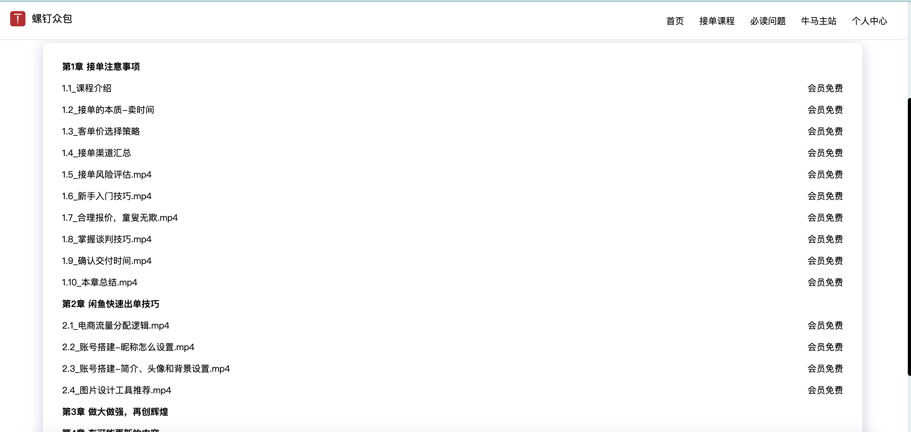

# 2024 螺钉众包启航

```
星星之火，可以燎原
```

:::tip

作者：迈克尔.牛马

一个臭不要脸卖课的人

联系微信：nodeing-cn

哔站：螺钉大叔与牛马程序员

抖音：迈克尔.牛马

:::

## 更名

我一直是一个臭不要脸的卖课博主，但还是保留了一点良心，市场环境不好的情况下，鼓励别人转行学 IT 是要遭天打雷劈的，学了又找不到工作，还浪费了时间，买课的同学就真的成了韭菜，这是违背我做教学的初衷的，于是，我就尝试着探索程序员变现的方式，自己去亲身实践，最终发现，我曾经一直看不上的外包接单方式，竟然是程序员最容易的变现方式，我以调侃的方式说我搞了一个牛马众包平台，把外包公司的价格打下来，在正式接单 1 个月后，营收突破了 2 万元，这里还不包括那些没统计到的成交金额，实际应该是大于 3 万的，基本上确信程序员接单这条路是可以走得通的，而且对大部分人来说是可行的，在具体执行的过程中，很多人在我的评论区说我把程序员当牛马，打价格战，这里清者自清，我倒是没怎么在意，但长期以这种自嘲的方式宣传，不利于后期招揽比较大的客户，因此，我打算把原来的牛马众包正式更名为“螺钉众包”

## 简介

定义：

```
螺钉众包是一个由众多程序员组成的接单小分队，是一个成员分布在全国各地的远程接单组织，帮助企业和个人解决日常外包需求，降低整体开发成本
```

:::tip
注意：螺钉众包不是一个公司，不会以公司的形式来运营，更不是一个中介平台，不会以平台的形式运营，本质上我们是一群程序员组成的个体联盟
:::

## 缘起

我有一个朋友是干贷款中介的，可以做车贷、房贷，这些年混得风生水起，在他们贷款行业做业务，两种方式去拓展新客户，一是自己去发小卡片，就是拿着贷款的小卡片跑到停车场去往车上塞，二是同行介绍客户，每个贷款中介都会积累很多同行的资源，举个例子：你主要是民生银行渠道放款的，来了一个客户，不满足你们民生银行的贷款条件，你做不了，但是这个客户的资质是满足华夏银行贷款条件的，此时，你正确的做法是把这个客户推荐给有华夏银行渠道的中介，你从这个中介手里拿推荐费，这样你手里的客户就不会浪费，在他们这个行业，中介之间互相推荐单子是非常常见的事情，基于这样的情况，我在想，程序员接单是否也可以效仿贷款中介的模式，做一个程序员个体众包联盟的想法就是这样产生的

## 众包联盟

众包联盟的目的是辅助程序员变现，帮助程序员成长为超级个体，你不用担心自己的技术栈不够全面，因为有众包联盟的其他兄弟可以帮你搞定，举几个例子：

你是一个 Java，你不会前端，当你接到一个全栈的需求，你搞不定的时候，你就可以从众包联盟里面找一个前端和你合作

你是一个正在转行学 IT 的新手，你完全没有开发能力，你接到一个单不知道怎么做，你可以把这个单转包给众包联盟兄弟帮你做

你是一个在校的大学生，你的同学都有找人做作业、做毕设的需求，你可以把这些需求转包到众包联盟的兄弟手上，拿抽成

```
每一个程序员都是一个生产者，通过接单赚钱，此时，你卖的是你的劳动时间
每一个程序员都可以是一个中介，通过发单赚钱，此时，你卖的是你的客户资源
```

## 加盟条件

:::tip

1.准备好 1 个闲鱼店铺，加入的时候提交店铺名称

2.付费加群，发 9.9 红包，拉入微信群

3.购买《程序员副业接单攻略》课程，免费拉进群，这条是可选的

:::

关于前两个条件的说明，前面我说的贷款中介之间相互推荐单子，一个中介收到了另一个中介推荐的单子，是需要主动给别人转推荐费的，如果一个中介给你推荐客户，你特么啥都不表示一下，下次就没人愿意推单子给你了，这是他们行业内形成的默契，在我们程序员行业，有很多人是没有付费意识的，只想着特么的白嫖，试想一下，你辛辛苦苦搞一个单子回来，有一群人来白嫖你，客户是搞定的，钱是别人赚的，出了问题客户还要找你麻烦，因为是你推荐的程序员帮他干的活，这个时候，你干活没钱还要承担风险，你还愿意这个群里有白嫖用户吗？连特么 9.9 的红包都不愿意发的人，干嘛要跟他合作，是不是这个理

要求每个人都准备一个闲鱼店铺，是因为担保的需要，客户不可能无缘无故的就信任你，作为个体，没干活就让人把钱打到你微信或者支付宝，万一你不干活跑路了咋办，同时，有些客户也挺蛋疼，让你开始干活了，然后中途跑路，这个时候，又没有给钱，你浪费了半天时间咋搞，因此，我们需要一个稳定的第三方来做担保，这样对双方都有好处，双方都更放心一些，所以，每个加盟的小伙伴，都必须要准备好一个闲鱼店铺，现在开店是零成本的，不需要交押金什么的，只需要你用淘宝账号登录一下即可

## 禁止行为

:::tip

众包联盟的成员，禁止派中介的订单

:::

关于这条的解释，通俗的说就是你别当二道贩子，你派的订单应该是你自己店铺或者短视频来的订单，你是要直接对接客户的，如果你的订单是中介给你的，这个时候，你根本没有办法对接客户，中介经过几次转发，一方面是中间商太多，抽成太高，程序员拿得更低，另一方面是没法和客户直接沟通需求，沟通成本会上升，需求不明确，容易产生纠纷，我们鼓励你派单，是你做不了的单可以推荐出来，而不是鼓励你从中介哪里搞单，然后再当中介，一旦发现有人从中介手里派单，拿抽成，并且产生了纠纷，就会上我们的江湖追杀令，踢出群，永不合作

## 江湖追杀令

公平合理为信，信任是双方合作的基础，但在实际的交易过程中，难免会产生纠纷，难免会出现一些坑逼来使坏，拿钱跑路，造成客户损失的，一旦发现这种行为，经过我们核实以后，会做以下处理：

```
1.建立黑名单机制，被拉黑的用户，踢出群，永远不能加入

2.信息公开，自媒体揭露，如果是程序员坑人，影响他后续接单，如果是客户坑人，以后没人做他的需求

3.情节严重的，报警处理

```

## 接单攻略

我在自媒体平台的账号叫做，迈克尔.牛马，意为卖课的人，我做 IT 类课程很多年了，曾经是某知名线下 IT 培训机构的老师，我把接单踩坑的经历和运营推广的经验录制成了课程，叫做《程序员副业接单攻略》



这套课程可以打开你的思路，帮助你能更快的通过闲鱼出单，也能帮助你在谈单的过程中，拿到更高更合理的价格，而不是一味地卷价格来成交

这套课程是按年持续更新的，39.9/1 年，一年时间到期后，可以申请下载视频源文件到本地播放，永久观看

很多程序员没有销售思维的，原本 1500 的单子，最终 1000 成交，累死累活还在那骂我把价格卷低了，把人当牛马，我们这套课程不是为了教你高价去坑客户，而是告诉你，你能拿到更合理的价格和更多高质量的单子

有人说这还用人教吗？是不是割韭菜，反正只要你卖课就有人喷，卖课就等于卖身，但我想告诉你的是，人永远挣不了认知以外的钱，既然我们叫做众包联盟，我一个月搞 2 万、3 万天花板很低，如果能有人复制了我的经验，能出现 10 个、100 个、1000 个人能月营收 2 万、3 万，我们整个众包联盟的营收就是几百万上千万，这样才能真正的形成影响力

最后，把一句话送给各位

```
星星之火，可以燎原
```
