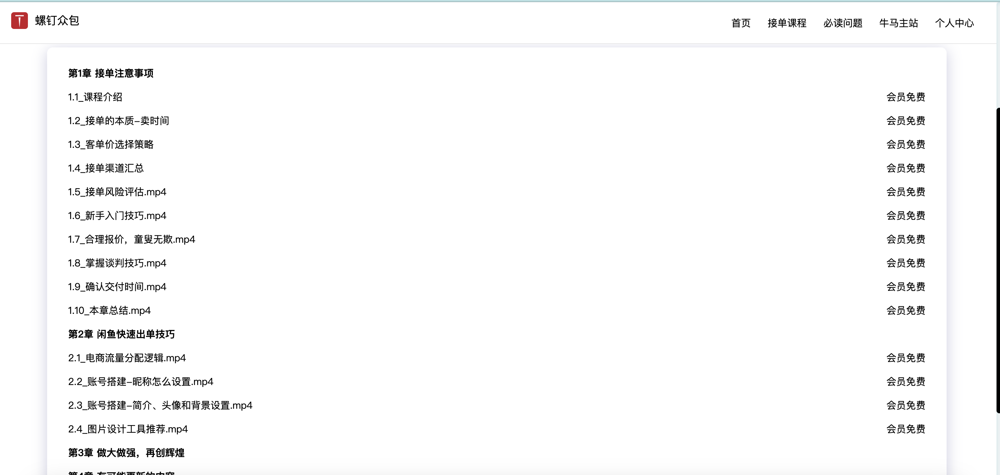

# 螺钉众包接单社群详情介绍

```
星星之火，可以燎原
```

:::tip

作者：迈克尔.牛马

一个臭不要脸卖课的人

联系微信：Michael-Niuma

哔站：螺钉大叔与牛马程序员

抖音：迈克尔.牛马

小红书：迈克尔.牛马

螺钉众包官网： https://nodeing.com

备用网站： https://zb.itniuma.com

:::

## 社群即将停止纳新

:::danger

注意：接单社群即将停止新人加入，想要加入的小伙伴，想要加入的小伙伴，请尽早联系

:::

互联网行业的增长遇到了瓶颈，各大企业裁员，程序员的就业环境越来越差，我在最近一年运营接单社群感受非常明显，十几年工作经验的、有大厂背景的程序员找工作都困难，加入到了我们接单社群开始接单，在这种失业潮的大势下，我们作为个人是非常渺小且无法阻挡的，如果不顺势而为，结局就是大家都被卷死，我个人能力有限，目前也只能带领一部分人接单搞钱，社群太大，管理不过来，所以，我决定最后再吸纳 500 名高级会员入群，500 名名额满了以后，停止纳新，只保留老成员，老成员可以继续接单，新成员暂时不开放，在停止纳新以前，10 块入群方案继续有效，要加入的也可以联系我

## 视频介绍

:::tip
以下是视频介绍，内容有点长，但很详细，请耐心看完，如果实在没耐心，请先看后面的文字介绍，文字介绍看完后还有兴趣加入，再看视频介绍
:::

<iframe src="//player.bilibili.com/player.html?aid=1700605061&bvid=BV1EK421k7bp&cid=1442437674&p=1" scrolling="no" border="0" frameborder="no" framespacing="0" allowfullscreen="true"> </iframe>

<style>
iframe{
    width: 720px;
    height:480px;
    border-radius:8px;
}
/* 对于小于等于 768px 的屏幕 */
@media screen and (max-width: 768px) {
    iframe {
        width: 100%;
        height: auto;
        aspect-ratio: 16 / 9; /* 保持 16:9 的宽高比 */
    }
}
</style>

## 更名

我一直是一个臭不要脸的卖课博主，但还是保留了一点良心，市场环境不好的情况下，鼓励别人转行学 IT 是要遭天打雷劈的，学了又找不到工作，还浪费了时间，买课的同学就真的成了韭菜，这是违背我做教学的初衷的，于是，我就尝试着探索程序员变现的方式，自己去亲身实践，最终发现，我曾经一直看不上的外包接单方式，竟然是程序员最容易的变现方式，我以调侃的方式说我搞了一个牛马众包平台，把外包公司的价格打下来，在正式接单 1 个月后，营收突破了 2 万元，这里还不包括那些没统计到的成交金额，实际应该是大于 3 万的，基本上确信程序员接单这条路是可以走得通的，而且对大部分人来说是可行的，在具体执行的过程中，很多人在我的评论区说我把程序员当牛马，打价格战，这里清者自清，我倒是没怎么在意，但长期以这种自嘲的方式宣传，不利于后期招揽比较大的客户，因此，我打算把原来的牛马众包正式更名为“螺钉众包”

## 简介

定义：

```
螺钉众包是一个由众多程序员组成的接单小分队，是一个成员分布在全国各地的远程接单组织，帮助企业和个人解决日常外包需求，降低整体开发成本
```

:::tip
注意：螺钉众包不是一个公司，不会以公司的形式来运营，更不是一个中介平台，不会以平台的形式运营，本质上我们是一群程序员组成的个体联盟
:::

## 缘起

我有一个朋友是干贷款中介的，可以做车贷、房贷，这些年混得风生水起，在他们贷款行业做业务，两种方式去拓展新客户，一是自己去发小卡片，就是拿着贷款的小卡片跑到停车场去往车上塞，二是同行介绍客户，每个贷款中介都会积累很多同行的资源，举个例子：你主要是民生银行渠道放款的，来了一个客户，不满足你们民生银行的贷款条件，你做不了，但是这个客户的资质是满足华夏银行贷款条件的，此时，你正确的做法是把这个客户推荐给有华夏银行渠道的中介，你从这个中介手里拿推荐费，这样你手里的客户就不会浪费，在他们这个行业，中介之间互相推荐单子是非常常见的事情，基于这样的情况，我在想，程序员接单是否也可以效仿贷款中介的模式，做一个程序员个体众包联盟的想法就是这样产生的

## 众包联盟

众包联盟的目的是辅助程序员变现，帮助程序员成长为超级个体，你不用担心自己的技术栈不够全面，因为有众包联盟的其他兄弟可以帮你搞定，举几个例子：

你是一个 Java，你不会前端，当你接到一个全栈的需求，你搞不定的时候，你就可以从众包联盟里面找一个前端和你合作

你是一个正在转行学 IT 的新手，你完全没有开发能力，你接到一个单不知道怎么做，你可以把这个单转包给众包联盟兄弟帮你做

你是一个在校的大学生，你的同学都有找人做作业、做毕设的需求，你可以把这些需求转包到众包联盟的兄弟手上，拿抽成

```
每一个程序员都是一个生产者，通过接单赚钱，此时，你卖的是你的劳动时间
每一个程序员都可以是一个中介，通过发单赚钱，此时，你卖的是你的客户资源
```

## 加盟方式

方式 1：非会员方式加入

:::tip

非会员方式入群，最低只需要花 10 块钱，只能加入 1 个群，有效期最长 6 个月，最短 1 个月，因为我们的群是半年解散 1 次后重新新建，你如果在即将解散的时候加入，时间就会变短，到期后需重新付费加新群，开通这种方式的主要目的是帮助我们这边的高级课程会员做店铺销量的，高级课程会员有拉人权限，他们可以拉人进群，想通过这种方式入群的兄弟需要去淘宝或者闲鱼店铺下单，确认收货好评后才可以加入，这种方式更麻烦一些，但是你的付款方式会增加我们店铺的曝光，有了单子也是丢群里大家一起完成，也是一种双赢的方案
:::

方式 2：基础会员方式加入

:::tip

基础 VIP 会员价格是 159 元一年，可以加入群有两个限制：1、状态为可加入(即没有满) 2、非课程群（注：独立开发者交流区的群为课程群） ，通俗的说就是加群主页上除开课程群以外，没有满的群都可以加入，如果群满了就没法加了，会员到期后，无时间限制的群可以永久保留，不需要另外付费，有时间限制的群，需要重新付费后才能加入，这种入群方式适合只想当牛马接单的小伙伴，入群接单一般会抽 1-3 成，具体抽成多少，需要和派单的小伙伴联系私聊

:::

方式 3：高级课程会员方式加入

:::tip
高级课程会员价格是 199 元一年，是当前我们网站会员的最高权限，包含基础 VIP 会员的所有权限，并且有体系化的运营课程和一对一答疑指导，试想一下有人带你搞钱，带你入门，只收你 199，我想应该是白菜价了，最重要的一点是拥有拉人的权限，这意味着你不仅可以接单赚钱，还可以通过拉人入群获得佣金，我们新建的体验群入群费用是 10 元，你拉的人你自己收费，这是有非常大的妙用的，具体的用处我会在运营课程里面讲解，这种入群方式适合那些想派单、想搞运营、想提升接单上限的小伙伴加入，如果你是一个新手，不想永远当牛马接单，那么可以选择这种方式入群，在派单的人眼里，接单的人只是供应商，派单的人采购牛马的时间，赚差价，做大做强
:::

高级会员权益详情，请访问：[点击进入](https://zb.itniuma.com/vip)

## 加入注意事项

前面我说的贷款中介之间相互推荐单子，一个中介收到了另一个中介推荐的单子，是需要主动给别人转推荐费的，如果一个中介给你推荐客户，你特么啥都不表示一下，下次就没人愿意推单子给你了，这是他们行业内形成的默契，在我们程序员行业，有很多人是没有付费意识的，只想着特么的白嫖，试想一下，你辛辛苦苦搞一个单子回来，有一群人来白嫖你，客户是你搞定的，钱是别人赚的，出了问题客户还要找你麻烦，因为是你推荐的程序员帮他干的活，这个时候，你干活没钱还要承担风险，你还愿意这个群里有白嫖用户吗？连特么 10 块钱都不愿意支付的人，干嘛要跟他合作，是不是这个理

注意：每个人都需要准备一个闲鱼账号，用来做担保交易，客户不可能无缘无故的就信任你，作为个体，没干活就让人把钱打到你微信或者支付宝，万一你不干活跑路了咋办，同时，有些客户也挺蛋疼，让你开始干活了，然后中途跑路，这个时候，又没有给钱，你浪费了半天时间咋搞，因此，我们需要一个稳定的第三方来做担保，这样对双方都有好处，双方都更放心一些，所以，每个加盟的小伙伴，都必须要准备好一个闲鱼账号，发布一个商品，用来收款，现在开店是零成本的，不需要交押金什么的，只需要注册一个账号，绑定收款支付宝即可

## 禁止行为

:::tip

众包联盟的成员，禁止派中介的订单

:::

关于这条的解释，通俗的说就是你别当二道贩子，你派的订单应该是你自己店铺或者短视频来的订单，你是要直接对接客户的，如果你的订单是中介给你的，这个时候，你根本没有办法对接客户，中介经过几次转发，一方面是中间商太多，抽成太高，程序员拿得更低，另一方面是没法和客户直接沟通需求，沟通成本会上升，需求不明确，容易产生纠纷，我们鼓励你派单，是你做不了的单可以推荐出来，而不是鼓励你从中介那里搞单，然后再当中介，一旦发现有人从中介手里派单，拿抽成，并且产生了纠纷，就会上我们的江湖追杀令，踢出群，永不合作

## 江湖追杀令

公平合理为信，信任是双方合作的基础，但在实际的交易过程中，难免会产生纠纷，难免会出现一些坑逼来使坏，拿钱跑路，造成客户损失的，一旦发现这种行为，经过我们核实以后，会做以下处理：

```
1.建立黑名单机制，被拉黑的用户，踢出群，永远不能加入

2.信息公开，自媒体揭露，如果是程序员坑人，影响他后续接单，如果是客户坑人，以后没人做他的需求

3.情节严重的，报警处理

```

我们已经建立了黑名单仓库，希望大家都尽量遵守规则，不上黑名单，详情：[https://gitee.com/nodeing/niuma-blacklist](https://gitee.com/nodeing/niuma-blacklist)

## 改变

在接单社群运营的过程中，我们接单社群的周期性问题比较显著，一个群在最开始建立的时候非常活跃，随着大家合作对接的深入，大多数人都能在群里找到合作伙伴，建立合作关系，当一个派单的小伙伴有单子需要找人做的时候，首先想到的就是曾经合作过的人，那他就没有必要把单子丢到群里，一个人在群里待一段时间以后，微信好友里面肯定会积累不少人脉，因为我们是允许并且鼓励大家私下加好友交易的，基于这种机制，接单社群到了后期就不怎么活跃了，你可以认为这就是接单社群生命周期的衰退期，因为这种现象的存在，我们接单社群也进行了相应规则的调整，那就是把处于衰退期的群解散，然后重新建新群，重新拉新人进群，注入新鲜的血液，根据我们的观察，一个群，大概半年时间会进入衰退期，因此，我们的规则定义如下：

```
1.从新群建立这天开始算起，半年后解散该群，重新建新群

2.网站高级会员可以无限制加群，这样一个会员在有效期内，新建的群都是可以进入的，群的解散对会员没有任何负面影响，反而是新群可以给你提供更多的合作伙伴，让你积累更多的人脉资源

3.网站高级会员可以拉人进群，我们规定每个人进群都是10元入群费用，拉一个人进群，你可以自行收取10元费用，变相增加了一种搞钱的方式

4.非会员入新群，需要付费10元，同时只能入1个群，需要等群解散后，重新付费进入下个群

```

可以加入哪些群，详情请访问加群主页：https://zb.itniuma.com/group，在这个加群主页上面，凡是状态为可申请加入的，高级会员都可以在网站上申请加入，非会员需要咨询站长，具体加哪些群由站长告知


## 接单攻略

我在自媒体平台的账号叫做，迈克尔.牛马，意为卖课的人，我做 IT 类课程很多年了，曾经是某知名线下 IT 培训机构的老师，我把接单踩坑的经历和运营推广的经验录制成了课程，叫做《程序员副业接单攻略》



这套课程可以打开你的思路，帮助你能更快的通过闲鱼出单，也能帮助你在谈单的过程中，拿到更高更合理的价格，而不是一味地卷价格来成交

这套课程是按年持续更新的，课程地址：[点击进入](https://nodeing.com/video-class)，开通 VIP 会员即可学习

很多程序员没有销售思维的，原本 1500 的单子，最终 1000 成交，累死累活还在那骂我把价格卷低了，把人当牛马，我们这套课程不是为了教你高价去坑客户，而是告诉你，你能拿到更合理的价格和更多高质量的单子

有人说这还用人教吗？是不是割韭菜，反正只要你卖课就有人喷，卖课就等于卖身，但我想告诉你的是，人永远挣不了认知以外的钱，既然我们叫做众包联盟，我一个月搞 2 万、3 万天花板很低，如果能有人复制了我的经验，能出现 10 个、100 个、1000 个人能月营收 2 万、3 万，我们整个众包联盟的营收就是几百万上千万，这样才能真正的形成影响力

最后，把一句话送给各位

```
星星之火，可以燎原
```
