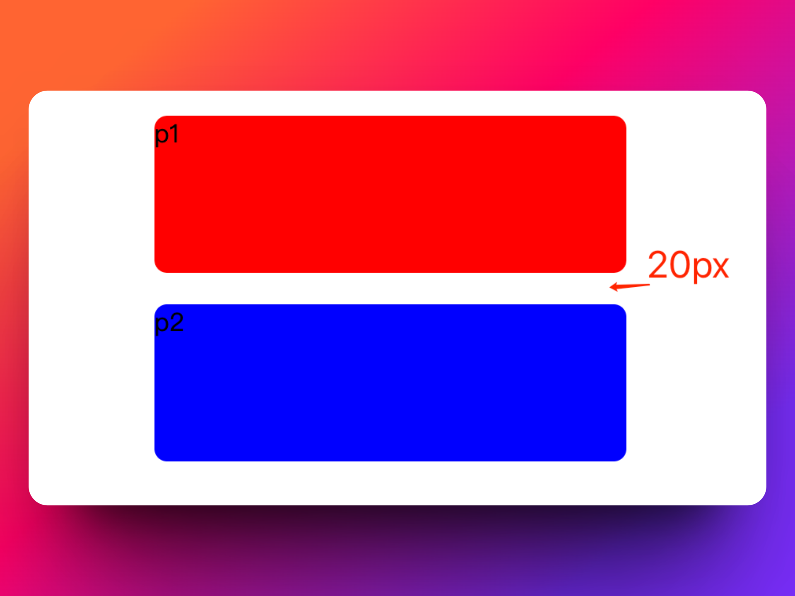

# margin 垂直方向塌陷或合并问题

## 1.问题复现

### 场景 1，兄弟相邻

在 CSS 中，当两个垂直方向的外边距（margin）相遇时，它们会合并成一个外边距，这就是所谓的 "margin 塌陷" 问题。这主要发生在块级元素的上下外边距之间。

举个例子：

```html
<style>
  p {
    height: 100px;
    width: 300px;
    margin: 20px auto;
    border-radius: 8px;
  }
  div p:nth-child(1) {
    background-color: red;
  }
  div p:nth-child(2) {
    background-color: blue;
  }
</style>
<div>
  <p>p1</p>
  <p>p2</p>
</div>
```



上面代码中，p1 的下外边距 20px， p2 的上外边距 20px，最终合并成 20px 而不是 40px

### 场景 2，父子相邻

上案例,下面代码中，p2 元素是 p3 元素的父元素，注意这个结构

```html
<style>
  .box {
    margin: 100px auto;
    width: 500px;
  }
  .p1,
  .p2,
  .p3 {
    width: 300px;
    border-radius: 8px;
  }
  .p1 {
    background-color: red;
    height: 100px;
  }
  .p2 {
    height: 200px;
    background-color: blue;
  }
  .p3 {
    background-color: green;
    height: 50px;
  }
</style>
<div class="box">
  <div class="p1">p1</div>
  <div class="p2">
    <div class="p3">这里是内部的p标签</div>
  </div>
</div>
```

上面代码运行结果是这样的


现在，我有一个需求，就是让 p3 这个元素和 p2 这个元素的顶部有 50px 的间隙，此时，很多初学者会给 p3 这个元素添加一个 margin-top

```css
.p3 {
  background-color: green;
  height: 50px;
  margin-top: 50px;
}
```

此时，展现出来的效果是这样的，并不符合我们的预期


## 2.为什么会发生这种情况？

这其实是 CSS 设计的一部分。W3C 的 CSS2 规范就有这样的规定：在垂直方向上，块级元素的相邻外边距会合并。这在大多数情况下都没有问题，但有时候可能会导致一些不期望的布局效果。

在 W3C 的 CSS2 规范中，有明确的规定说明了这个现象。你可以在这个链接中查看详细的规定：[https://www.w3.org/TR/CSS2/box.html#collapsing-margins](https://www.w3.org/TR/CSS2/box.html#collapsing-margins)。

## 3.margin 的塌陷和合并是一回事儿吗

"margin 合并"（Margin Collapsing）和 "margin 塌陷" 在很多文档和资料中被混用，通常用于描述相同的现象：当两个或更多垂直间距相遇时，它们会形成一个等于其中最大值的间距。但在某些情况下，这两个词可能有些微妙的区别。

"Margin 合并"更常用于描述正常的 CSS 行为，例如当两个兄弟元素的垂直 margin 相遇，或者当父元素与其第一个或最后一个子元素的垂直 margin 相遇时，这些情况下的 margin 合并是符合 CSS 规范的预期行为。

"Margin 塌陷"一词有时用于描述当由于 margin 合并导致的布局问题，比如一个元素的外边距被其子元素的外边距所“吞噬”，看上去就像那个元素的外边距“塌陷”了一样。这种现象主要发生在没有创建新的块级格式化上下文（Block Formatting Context）的父元素与其子元素之间。

但无论你选择使用哪个词，重要的是理解这种现象的本质，以及如何在需要的时候避免或利用它。

对于 "margin 合并"（Margin Collapsing）的概念和行为，你可以参考以下文档：

:::tip

MDN (Mozilla Developer Network) 文档：这个页面提供了对 "margin 合并" 的详细解释，并且列出了几种常见的 "margin 合并" 的例子。https://developer.mozilla.org/en-US/docs/Web/CSS/CSS_Box_Model/Mastering_margin_collapsing

:::

:::tip

W3C CSS 规范：这是 W3C 的官方 CSS 规范，其中详细说明了 "margin 合并" 的规则。https://www.w3.org/TR/CSS2/box.html#collapsing-margins

:::

## 4.解决方案有哪些？

对于垂直相邻的 margin 问题，尽量避免同时使用上下边距

对于父子相邻问题，可以参考以下几种解决方案：

方案 1. 使用边框（border）或者内边距（padding）：

在父元素中添加一个边框或者内边距可以阻止其与子元素之间的外边距合并。

```html
<style>
  .parent {
    border-top: 1px solid transparent;
    border-bottom: 1px solid transparent;
  }
  .child {
    margin-top: 20px;
  }
</style>

<div class="parent">
  <div class="child">This is a child div.</div>
</div>
```

或者

```html
<style>
  .parent {
    padding: 1px 0;
  }
  .child {
    margin-top: 20px;
  }
</style>

<div class="parent">
  <div class="child">This is a child div.</div>
</div>
```

方案 2. 使用 overflow 属性：

将父元素的 overflow 属性设置为除了 visible 之外的任何值（如 auto, hidden, scroll, or clip），也可以防止外边距合并。

```html
<style>
  .parent {
    overflow: auto;
  }
  .child {
    margin-top: 20px;
  }
</style>

<div class="parent">
  <div class="child">This is a child div.</div>
</div>
```

方案 3. 创建新的块格式化上下文（Block Formatting Context）：

可以通过为父元素设置 display: flex 或 display: grid 属性，或者设置 float: left/right 或 position: absolute/fixed 属性，来创建一个新的块格式化上下文，阻止外边距合并。

```html
<style>
  .parent {
    display: flex;
  }
  .child {
    margin-top: 20px;
  }
</style>

<div class="parent">
  <div class="child">This is a child div.</div>
</div>
```
