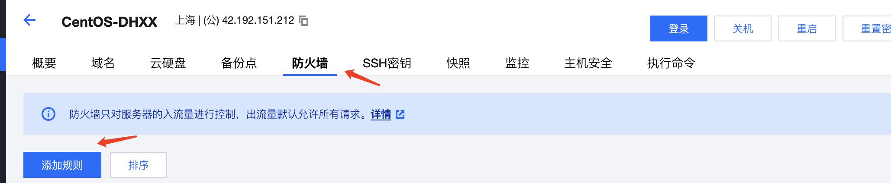

# 1.腾讯云服务器购买

## 1.1.服务器购买

下面是腾讯云的活动页，如果你是新注册用户，可以几十块钱买个服务器，用于学习是性价比非常高的事情

【腾讯云】轻量新用户上云福利，2 核 2G4M 低至 65 元/年 ， 超大容量云硬盘 0.5 折起！ [点击进入](https://cloud.tencent.com/act/cps/redirect?redirect=1079&cps_key=ddaf4c7f4d412ad97802959707d4dbf3&from=console)

进入到页面后，你可以根据自己的需求，购买一年服务器，目前的活动，最新的是 88/1 年


按照流程，购买即可，如果没有注册，需要先注册，然后进行实名认证

关于控制台的操作

第 1 步，在腾讯云官网右上角可以进入控制台


第 2 步，快捷操作


云产品比较多，你可以在上图的地方进行搜索，也可以自己慢慢找，不管用哪种方式，你常用的云服务产品，你可以把产品前面星点亮，点亮以后就会有快捷菜单，例如，下面的快捷菜单就是我自己添加的


有了这种快捷菜单，下次我们进入服务器和域名管理后台就方便了

:::tip
注意事项：当我们购买了轻量云服务器，默认会给我们分配一个公网的 IP 地址，这个地址你可以先拷贝下来，我们经常会用到这个 IP 地址
:::


进入到服务器的控制台，就可以看到

## 1.2.服务器登录

### 1.2.1.生成密钥

首先，生成 ssh 密钥，生成方式和我们第一章讲 ssh 免密登录 gitee 的方式一致，我把前面讲的步骤粘贴过来

第 1 步，进入到用户 home 目录

```
cd ~
```

创建一个.ssh 的文件夹，并且进入这个文件夹

```
mkdir .ssh
cd .ssh
```

第 2 步，生成 ssh 密钥对

```
// -C 后面的邮箱填写你自己的邮箱ß
ssh-keygen -t RSA -C "cnode@sina.com"
```

接下来，需要你填写密钥对的名字，这个名字你可以自己随便填，我这边习惯用域名来区分

```
➜  .ssh ssh-keygen -t RSA -C "cnode@sina.com"
Generating public/private RSA key pair.
Enter file in which to save the key (/Users/key/.ssh/id_rsa): t.nodeing.vip
```

上面的结果中，t.nodeing.vip 就是我自己取的名字，你可以自己自定义一个,登录远程服务器，我一般以自己的域名命名，例如，腾讯云的服务器就是 t.nodeing.vip 如果是阿里云的服务器，命名，a.nodeing.vip

接下来的步骤，一直敲回车即可

上面步骤执行完成后，会在你的.ssh 目录下，生成两个文件

```
t.nodeing.vip     这个是私钥
t.nodeing.vip.pub  这个是公钥

请记住，公钥和私钥的名字，后面配置要用到
```

注意，这两个文件名字就是你上一步自己定义的名字，和我这个不一样很正常哈

第 3 步，在.ssh 这个目录下，创建一个 config 文件，并添加下面的配置

```
## 腾讯云服务器

Host t.nodeing.vip
HostName 142.135.68.146
User root
## 这里是加载私钥，改成你电脑上的私钥文件名字
IdentityFile ~/.ssh/t.nodeing.vip
```

注意上面的配置，最后一行，是要加载你的 私钥，你需要改成你电脑上的名字

另外，HostName 这个属性，填写的是你腾讯云服务器的 ip 地址，你买了腾讯云服务器，会给你分配一个公网地址


### 1.2.2.密钥绑定

第 1 步，进入到你的腾讯云后台，找到你的轻量云服务器控制台，点击左边菜单的密钥


第 2 步，进入到密钥面板，创建密钥


第 3 步，导入已有公钥


这一步需要注意，地域选择需要和你的服务器一致，例如：我轻量云服务器是在上海，这里创建的密钥也是要选择上海


这里可以查看你的服务器区域

第 4 步，点击进入到你的服务器控制面板


第 5 步，绑定密钥


接下来，选择密钥


下一步，强制关机，点确定即可


等待绑定成功即可

第 6 步，打开防火墙端口，这一步操作的目的是方便我们访问宝塔可视化面板的页面，宝塔的 web 访问端口是 8848，
我们去把 8818-8898 的端口都打开，方便后续我们部署项目



填写好端口范围，然后点确定即可


第 7 步，测试登录,再终端里面输入命令

```
ssh t.nodeing.vip
```


注意哈，上面命令中的 t.nodeing.vip 这个是在我们配置的时候填写的


你输入命令的时候，要根据你自己的配置名称更改一下

[返回 -> 重学 Linux](/article/linux/)
