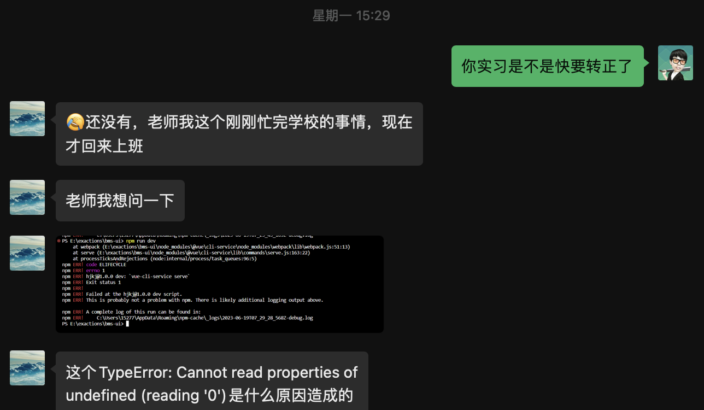

# 就业案例

## 前言

我是一个比较佛系的人，年龄大了心态也开始转变，更多的考虑工作以外的生活，躺平心态为主，12 年入行，到现在 10 多年了，做过开发，也在线下做过讲师，带出来的普通程序员也有个千八百的，也见证了太多转行失败导致生活一团糟的人，我不太喜欢用这些成功的案例来熬鸡汤，忽悠学生报名，但又不能一点都没有，因此，挑选一些有代表性的案例，有成功的，也有失败的，我希望这些案例都是带有温度的，接地气的，而不是高高在上的、年薪百万的，发这些案例仅仅是提供一个参考

:::tip
注意：别人的成功不可复制，只适合用来打鸡血，仅供参考，案例百分百保真，经得起考验
:::

## 案例收集

### 1.专科会计转行

这是一个妹子，我就叫小贞（化名）吧，2020 年的时候跟着我学前端，当时我还在做直播讲课，卖课的平台是网易云平台（前两年我的课在网易平台是比较畅销的，经常排第一，好评如潮），这个妹子在网易学了我的课程后了解到有直播课程，于是跟着我的节奏学了 8 个月左右

2020 年还没有太卷，但是工作还是难找，因为疫情，很多企业都很难受，这个妹子会计做了 2 年吧，薪资 6000 左右，不想做会计了考虑转行的，跟我学了 8 个月左右，其实技术还是比较差，找工作其实是比较困难的，由于家里有点关系，去了一家公司找到了一个前端岗位，公司就她一个前端，没有人带，薪资 6000 左右，和她做会计薪资一样，虽然有关系进入到了公司，但干不下来也没有人养闲人，她报了我的一对一答疑服务（当时我一对一答疑服务 2 个月收的 6000 块），工作上的一些问题我会帮忙提供一些答疑，最后顺利转正了

对于转行，真正能过试用期才算是稳定，虽然她的起点不是太高，不像有些培训机构学生包装简历拿得那么高，但能真正成功转行，前期薪资不用在意，这是我给的建议，到目前为止，过的还算稳定，打算年中跳槽了，她们经理说工资涨到满意，不知道会涨多少，这是实打实的工作经验，要是再包装一下简历跳槽，妥妥的 12k 起步

:::tip
2 年实打实的前端经验，薪资 7k，坐标广东，这里没有高大上的年薪百万，只有更接地气的普通人
:::

### 2.应届大专生转前端

这个案例的主人公我就叫小民（化民）吧，也是 2020 年跟着我学前端的，大三开始自学，学历是一个大专，山东的某技术职业学校，大家一听这个学校名称，应该都能知道学校是很垃圾的，如果在大学不自学，毕业后大概率是进厂打螺丝的命运，但谁又是真想进厂打螺丝的呢，小民也是从网易云课堂平台找到我的，跟着我的课程体系学了半年，由于他姐姐在成都这边工作，毕业后来到了成都，正好我也在成都，有个朋友组建了一个团队在接外包，我就让小民到公司里面去学，说着到公司里面去学，实际上也没让他干活，只是给他安排了一个工位，他还是继续在看我的视频，同时公司里面的一些项目也会安排给他练习，这些练习其实都不会正式上线，经过两个月后，开始安排一些简单的活给他，例如：公司的官网什么的，也没有工资发给他，又过了两个月，开始接收一些功能模块的开发，我那朋友也开始象征性的给了一些工资，前前后后大概折腾了一年多一点点，21 年过完年，他就去上海了，到了上海，包装了 2 年的经验，在一家外企，拿了 9.5k, 在这里工作了快 1 年，跳槽到了 1 家外包公司，包装的 3 年经验，拿了 16.5k，最新的情况是调了小组，薪资涨到了 18k，在工作之余，偶尔会接一些小单，每个月也能挣个 2 万多，也许你会说，在上海 2 万多根本不算什么，但对于一个普通人，没学历，没背景，我觉得 2 万多一个月，也算得上比较好的情况了

### 3.科班成功入行

这个学生是某双非一本，软件工程专业，2022 年 6 月份看到了我在抖音上的直播，于是报名开始跟着我的课程学习，在 2023 年毕业前，春招找到了一个国企分公司实习，工资虽然低，但是为了混经验我还是让他去了，带薪学习的机会不多，这总比他们班去参加线下培训的同学好，他们班有 5 个去了某峰培训，出来全军覆没，一个都没找到工作

这是最新的聊天记录，还在问我问题

这是去年他们班培训的同学的结果

相比之下，我们的就业陪跑服务还算有性价比

### 4.30 岁非科班大龄转行

这个学生的情况是这样的，女生，年龄 29，学历本科，有国外工作经历，跟着我学的时候年龄比较大了，经过一年的学习年龄已经超过 30，完全是从零基础开始，当时敢收她的原因是因为她有国外工作经历，英语比较好，希望把她培养出来找一个国外的远程工作，因为她这个条件在国内找工作确实有点困难，这些情况在报名之前我们都会沟通好

今年 4 月份的时候，她打算在国内投简历试试，投了 100 多份简历，面试了 3 家公司，就找到了一份工作

刚入职第一个月，不知道怎么写代码，我们这边又继续辅导，终于在工作了一个多月后，开始开窍了

## 总结

:::tip

每个人都是独立的个体，每个人的资质、经历都各不相同，运气成分也有所差异，所以，别人的经历只可以拿来参考，但并不难复制，我们的案例还会持续更新，欢迎关注

:::
