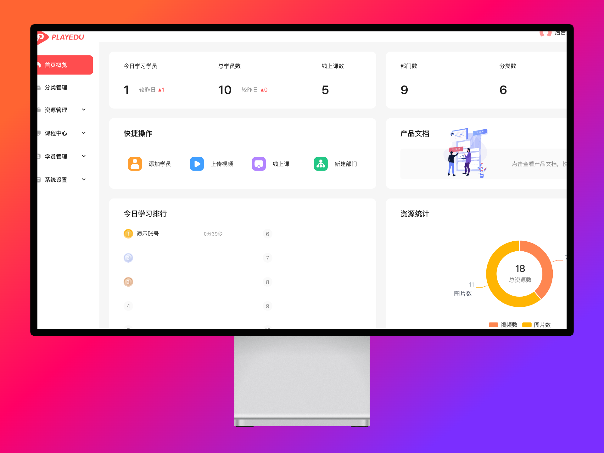
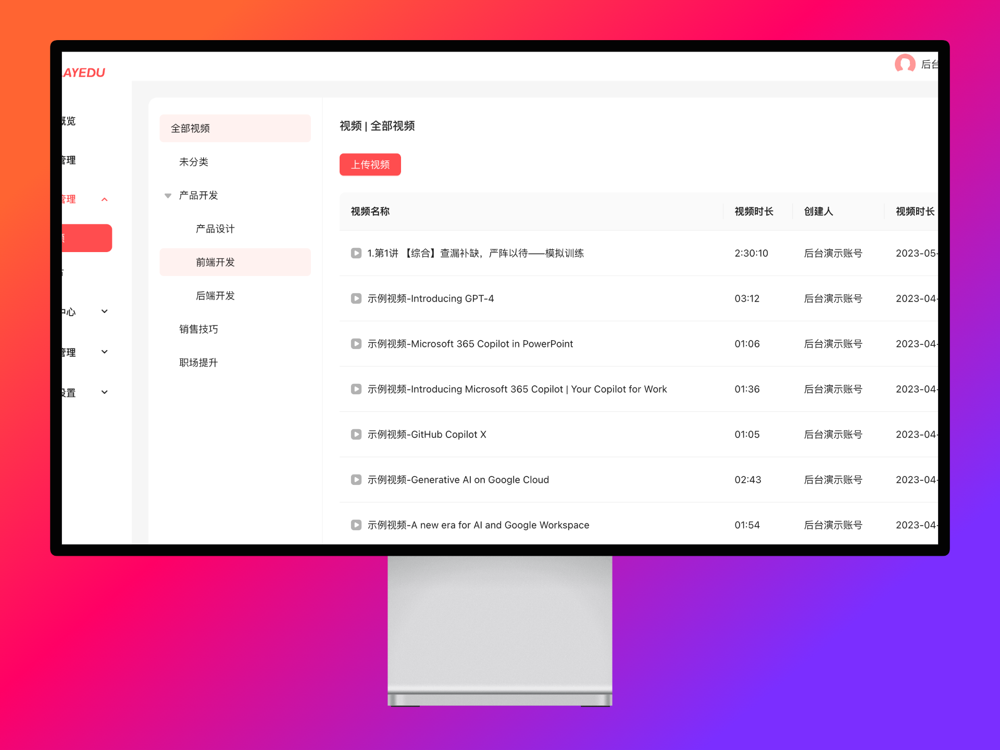

# TS 全栈开发体系课

这是我们推出的就业体系课程，关于什么是就业体系课程，请先移步：[就业体系课详解](/service/product/2.html)

了解完我们就业体系课的定位，你再来了解我们的《TS 全栈开发体系课》，对你学习的效果、未来的就业方向会有更深入的思考和帮助

## 课程指南

:::tip

这套体系课程是我们根据当前最新的市场调研推出的产品，叫做《前端 + Nestjs 后端+Web3 + AI 应用全栈》系列课程，学完后可以获得一套全栈的开发解决方案，一套高效的工作流程，一套商业及的产品源码

有就业需求的同学，认真学完这门课程，问题不大

关于课程的细节，请详细阅读完本文

:::

### 前言

> #### 为什么推出这套全栈课程？

我也是被那些唱衰 IT 的程序员博主影响的人，再加上 ChatGPT 的火爆，让我前几个月非常的焦虑，以至于想放弃录制课程，现在在短视频平台，如果不唱衰 IT，就不是政治正确，其实，那些程序员博主也没必要砸自己的饭碗，只是为了迎合观众罢了，这样才会有流量，有了流量才能变现，因此，你们会在他们的视频里面经常听到这样的主题

```
1.兄弟们，前端已经死了，很多培训机构出来的找不到工作了

2.兄弟们，Java崩盘了，找不到工作只有去搬砖了

```

结果呢，在直播的时候，又开始反向渲染

```
1.兄弟们，前端回暖了

2.兄弟们，Java回暖了
```

这样一来一去的表演，一些小白完全不敢入行了，一些要选计算机专业的同学望而却步了，这特么就是误人子弟

我想说一下，我们这边的观点

```
1.经济下行，青年失业率激增，这是整体的大环境，并不只是IT行业，因为干IT这波人天生就是玩儿互联网的，因此，在网上闹得最厉害，你们去看一下其他的专业、其他的方向，难道就业率就很好吗？这就是扯淡

2.互联网的行情是从一个整体的红利期到红利消失的一种转变，你原来从月薪两万，降到了月薪1万，心理难受不难，由俭入奢易，由奢入俭难，因此，有非常多的人难受，在抱怨，你们要客观的看待，退一万步说，从2万月薪降薪一半到1万，回归正常水平，那这个行业就没前途吗？就不是一个好的选项吗？

3.经过泡沫后的调整，我们要客观的认识到，长期的竞争是不可避免的，那怎么办？不活了吗？该卷的还是要卷？卷死各位就完事儿了，现在艰难又不是你一个人艰难，大家都很难，你需要做的事尽情的卷，干掉你的竞争对手来获得工作机会，而不是在那抱怨机会很少，找不到工作

4.行业门槛变高是好事情，有门槛的话，对于那些有敲门砖的人来说，这就是壁垒呀，如果你是科班的、本科的，你有天然的入场卷了，有壁垒了，坚持下来了，那些，非科班的、专科的、学历更低的人只能在门外看着，这难道不香吗

5.基于以上几点，现在入行确实很困难，因此，不建议非科班的、年龄大的、学历低的进来冒险，但是你如果是科班、本科，你就放心大胆学就完事儿了

```

以上这些观点仅仅是我们个人的认知，你不同意的话就是你说的对，我们没有太多时间和你杠，下面，我要说的是，如果你要进来卷，应该具备什么样的策略

用一句话来概括就是

```
差异化竞争才能脱引而出
```

为了了解实际的就业情况，我用了我的皮包公司，在 boos 上发布了 4 个岗位，用来测试收到简历的数据，这样可以帮助我大概率推测出竞争情况


总结一下上面的数据

```
java两个岗位：843+286 = 1129 份打招呼
前端两个岗位：946 + 22 = 968 份打招呼
```

从上面的数据可以看出，前端和 Java 作为 IT 行业最热门的两个方向，竞争情况都是在一个数量级别的，都特么卷，大哥别说二哥，如果你按照传统的课程学习，报培训班或者买线上课，这种无脑冲的模式，只有一个结果

```
大概率会被卷死
```

你们再来看看我发布的岗位特点，竞争最激烈的是初级岗位，初级 Java 打招呼的人数是 843，占比 74%， 初级前端打招呼是 946，占比 97%，这意味着初级已经竞争白热化了，这些初级前端、初级 Java 基本上都是培训班出来的，简历都一个样，怎么能找到工作呢？

那这个问题到底还有没有解？回答是肯定的

:::tip
先来思考一下我们前面提出的观点：差异化竞争才能脱引而出
:::

看了前面我们发布的数据，你有没有想过，为啥 Nodejs 岗位的招呼人数很少？因为大部分前端都不会去关注这个领域，这是后端干的事情，Nodejs 的竞争人群基本上都是别的语言转过来的，真正从零基础专门用 JS 写后端的人很少，再加上培训班没有把这块当成重点来培养，这些种种因素加起来，就使得这个岗位打招呼的人比普通前端要少很多

通过这上面的分析，能明白差异化的意思了么，就是去做一些和别人不同的事情，对一个 Nodejs 岗位来说，你熟了使用 JS 来开发后端应用，这是 95%以上前端都做不了的事情，那和剩下的 5%竞争，难度是不是就小很多了

你们下来再去搜一下 nodejs 后端，岗位也不少，虽然没有传统前端、Java 多，但门槛在那，已经帮你过滤了很多人了，你还怕个毛呀


> #### 为什么不推荐 Java 开发呢？

一方面是因为学习 Java 的人已经烂大街了，其次是因为 Java 卷到后面已经没有什么东西可以卷了，举个很简单的例子：一个 Java 项目想要有亮点，除了增删查改这些常用功能以外，无非就是三高，高性能、高并发、高可用，对于一个初学者，你没有实际的应用场景，你去搞这些高并发的项目其实是很假的，一眼就能看出来是假项目了，找工作就比较尴尬，增删查改没亮点，三高项目又太假，最终就卷到学历上去了，如果你已经有足够好的学历，花大把的时间卷 Java 又是性价比比较低的了

:::tip

我们这种卖课的机构，对市场如果不敏感，学生找不到工作，口碑崩裂了，那还卖个毛线的课程，《前端 + Nestjs + Web3 + AI 应用》这样的技术栈组合，是当前我们认为最佳的入行路径了，Java、Python、我们其实也有合作的讲师，但没有提上优先级，很大的原因就是发展前景的问题，但后面我们也会出相关的体系课程，因为，不管你怎么说，都有人要去冲，如果不做深度的交付，其实对于机构来说，最大的花费就是录课的成本而已，总有学生能找到工作，至于困难程度如何、是不是你找到工作，那就另说了，总之，目前来说，我们自认为，规划的学习路径还是比较科学的

:::

### 学习人群

```
如果你是本科、计算机专业，可以放心大胆的学，找工作问题不大
```

```
如果你是本科、非计算机专业，学习就需要更加努力，找工作看你的技术
```

```
如果你是专科、计算机专业，建议当爱好学，找工作看运气与技术
```

```
如果你是专科及以下学历，当爱好学，找工作靠运气，入行困难
```

### 课程的收获

学习完课程后，你将获得多方面的全栈技能

:::tip

1.具备前端开发能力，胜任前端开发工作

2.具备 TS 语言开发后端应用的能力，胜任后端开发工作

3.具备一定的运维能力和项目架构设计能力，找运维开发工作

4.具备 Web3 开发的能力，储备技术，布局未来

5.课程学习完成后，可以获得可以商用的全栈源码，可以独立部署运营

6.具备一定的产品和运营能力，开拓思维，可以做独立开发者

:::

我们以开源项目 playedu 为项目原型，使用全新技术栈在这个基础上拓展功能，把这个项目做成一个基于区块链技术的创新项目

项目截图：






项目官网：https://playedu.xyz/

PC 前台演示地址：

:::tip

网站地址(PC 端)：https://demo.playedu.xyz

演示账号：1@playedu.xyz

演示密码：123123
:::

管理后台演示

:::tip

网站地址(PC 端)：https://admin.playedu.xyz

后台演示账号：admin@playedu.xyz

后台演示密码：123123
:::

### 课程内容

> 第 1 部分，前端开发

:::tip

1.html+css 快速入门

2.一小时搞定 flex 布局

3.JavaScript 入门初体验

4.JavaScript 语法基础

5.JavaScript 事件精讲

6.JavaScript 原生对象

7.JavaScript 定时器

8.BOM 与 DOM

9.正则表达式

10.Node 核心基础

11.Ajax 基础

12.JavaScript 高级知识

13.ES6+快速入门

14.Vue 基础

15.Vue 全家桶

16.Vue 项目实战-仿魅族商城

17.Vue 项目实战-音乐 APP

:::

这一部分是前端基础部分，这部分的内容是所有进阶内容的基础，如果是零基础开始学的同学，需要从头掌握，这部分内容以视频教程为主，视频质量经过大几千用户检验，学习高效，没有废话，跟着课程的内容练，问题不大

> 第 2 部分，Nest 框架基础

:::tip

1.Nestjs 基础

2.MySQL 详解

3.TypeORM 详解

4.Redis 快速入门

5.通用权限控制系统实战

6.项目部署实战

:::

这部分内容的目的是熟悉使用 Nest 这个后端框架，跑通整个项目开发的流程，从嘴基础的框架使用，到最后项目上线部署，走完一个完整的流程，学完这部分内容，应该能知道一个单体服务是怎么开发出来的了

> 第 3 部分，微服务

:::tip

1.微服务基础理论

2.配置中心

3.注册中心

4.RabbitMQ 快速入门

5.nginx 入门

6.微服务电商项目实战

7.Docker 入门

:::

这部分内容是后端微服务知识的系统讲解，课程里面讲解了后端微服务架构下需要用到的各种中间件，同时会以一个微服务电商项目为案例，将用到的微服务知识串联起来，经过这个阶段的学习，能理解微服务架构的各种细节，为后续做商业级的项目打基础

> 第 4 部分，前端进阶

:::tip

1.通用后台管理系统解决方案--Vue 版本

2.React 全家桶

3.通用后台管理系统解决方案--React 版本

4.Vue 源码解析

5.React 源码解析

6.前端工程化

7.前端提效工具研发

:::

这部分是前端的进阶内容，涉及到非常多的前端高价知识，难度层次会飙升，但收获会很大，能做到质的飞跃，这是你能在前端开发岗位脱引而出必须要学习的内容，学完这部分内容，碾压培训班出来的前端，问题不大，有些同学学完这个阶段有可能去投简历拿 offer 去了

> 第 5 部分，项目实战

:::tip

1.僰课学城服务端项目实战

2.僰课学城后台管理系统项目实战

3.僰课学城 PC 端项目实战

4.僰课学城 APP 项目实战

:::

这一部分是真正的商业实战，我们将从零到一，开发一个线上运营的在线教育项目，并且这个项目将是我们长期运营的项目，这部分内容以实际开发为主，文档和视频教程都会少，经过这个项目的洗礼，你才能真正独立的开发一个应用，你才算得上真正学会编程，当你已经学会编程了，找工作还会难吗

> 第 6 部分，Nodejs 进阶和其他框架

:::tip

1.Nodejs API 基础

2.Express 框架

3.Koa 框架

:::

这部分内容是选学内容，了解一下 node 后端生态里面的其他框架，如果工作中用到，可以快速上手

> 第 7 部分，专业方向-进军 Web3

:::tip

1.JS 手写区块链

2.Go 语言实现迷你比特币系统

3.密码学基础入门

4.以太坊开发入门

5.以太坊开发实战-钱包项目

6.vue3+naiveui 开发链上选课系统

7.NFT 项目实战

8.联盟链入门与实战

:::

这部分内容是比较硬核的了，我们这边坚定的认为 Web3 是下一代互联网，区块链技术是放到了国家战略高度的，一旦应用大规模落地，将迎来非常大的机会，虽然现在很多人不看好国内的生态，基本上都是出海做相关的业务，但是我们还是坚信这个方向是可以挣钱的，远程工作机会比较多，如果你学历学校还不错，英语过得去，在这个行业混比其他大部分行业都要好，这是我认为最有可能财富自由的行业了

> 第 8 部分，专业方向-AI 应用落地开发

:::tip

1.零基础玩转 ChatGPT

2.ChatGPT API 代理平台开发

3.AI 平台插件开发

4.基于 Langchain 的项目实战

:::

这个部分的内容是当下最火热的风口，AI 通用大模型的大规模落地，这是普通程序员千载难逢的机会，李开复的机构预测的，AI2.0 时代，几乎所有的应用都可以基于 AI 重做一遍，这个机会比传统互联网大 10 倍，如果你还纠结互联网大红利消失，还不如抓住未来的红利，提前布局

### 课程价格

从零开始学习这套系统的课程，总价格：<span style="color:red;font-weight:bold;">4980</span> 元

单买 Web3 部分课程，价格：<span style="color:red;font-weight:bold;">1980</span>元

单买 Nestjs 语言部分课程，价格：<span style="color:red;font-weight:bold;">1980</span>元

单买《前端工程化提效》课程价格：<span style="color:red;font-weight:bold;">499</span>元

##### 活动

普通班：如果想要购买整个体系课程，前 100 名，早鸟价：<span style="color:red;font-weight:bold;">998</span>元

协议班：仅限前 100 名，报名签订就业服务合同，找不到工作退全款，价格：<span style="color:red;font-weight:bold;">1998</span>元，协议班要求具有本科及以上学历

### 学习方式

报名后，我们会给你提供我们内部学习平台的账号，你跟着学习路线学习即可


