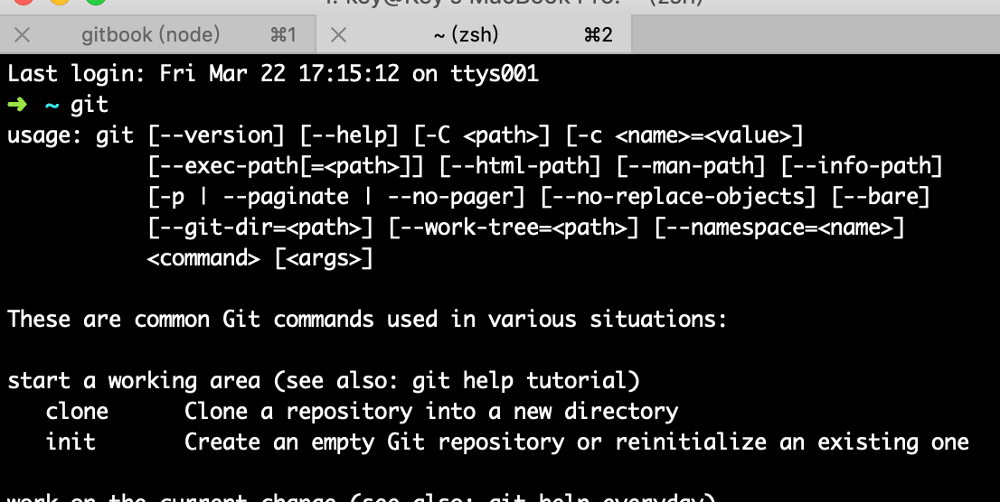

# Git 高效入门指南

:::tip
如果链接失效或者有其他问题，请联系牛马程序员金牌讲师--迈克尔.牛马，微信：nodeing_cn
:::

## 1.2.git 安装

### 1.2.1.Mac 系统安装 git

Mac 默认是自带 git 的，可以打开终端，输入 git，查看



如果你运行后,看英文提示，说找不到这个命令，那么你就需要自己安装，首先需要确定有没有安装 brew，如果没有安装，那么你需要先安装 brew，这是一个 Mac 系统上安装软件的工具

```js
/usr/bin/ruby -e "$(curl -fsSL https://raw.githubusercontent.com/Homebrew/install/master/install)"
```

安装好 brew 后，执行命令安装 git

```
brew install git
```

### 1.2.2.windows 系统安装 git

下载地址：[https://npm.taobao.org/mirrors/git-for-windows/v2.21.0.windows.1/Git-2.21.0-64-bit.exe](https://npm.taobao.org/mirrors/git-for-windows/v2.21.0.windows.1/Git-2.21.0-64-bit.exe)

安装方式比较傻瓜化，直接点下一步就 ok

安装完成后，直接在 windows 的命令窗口中输入 git，如果出现下面这种结果说明安装好了


