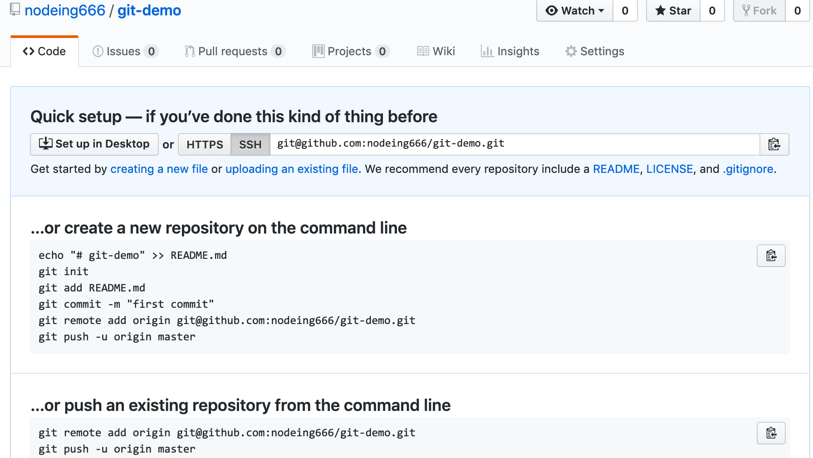

# Git 高效入门指南

:::tip
如果链接失效或者有其他问题，请联系牛马程序员金牌讲师--迈克尔.牛马，微信：nodeing-cn
:::

## 1.3.github 简单使用

github 网址： http://github.com, 注册账号过程简单，这里直接跳过，接下来我们介绍一下创建仓库的过程

1.右上角，New repository


2.填写必要信息，包括仓库名称，描述以及是否公开，填写完成后点击 create 按钮


3.创建成功



4.测试克隆仓库

在命令行窗口中输入

```js
git clone https://github.com/nodeing666/git-demo.git
```

5.在 git 端设置贡献者

注意，这里设置的邮箱和 name 最好和 github 使用的邮箱一致

```js
git config --global user.name nd-00002
git config --global user.email 18898887379@163.com
```

接下来查看配置是否成功

```js
git config --list
```
