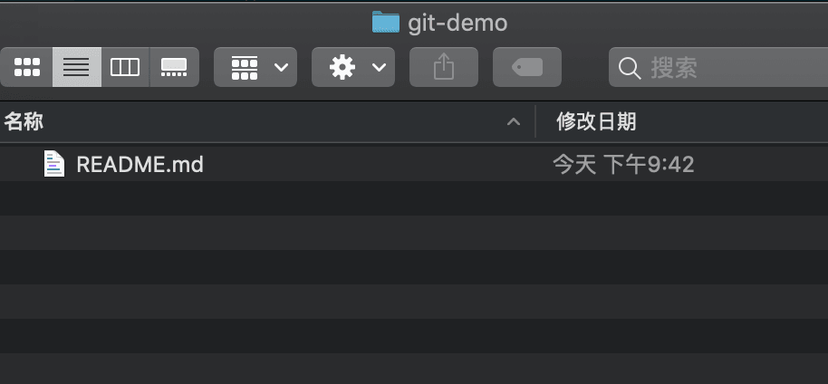

# Git 高效入门指南

:::tip
如果链接失效或者有其他问题，请联系牛马程序员金牌讲师--迈克尔.牛马，微信：nodeing-cn
:::

## 2.1.git 的三个区

1.工作区

工作区就是你项目所在目录，这个目录是可以非常直观的看到的，编写代码主要在这个目录进行，例如：

2.暂存区

暂存区从字面上去理解就是用来暂时保存项目的地方，实际上它的作用和它的名字是一致的，暂存区可以起到过渡的作用，当我们写代码修改了一些文件的时候，可以把修改的代码提交到暂存区保存，然后接着写代码，接着再提交到暂存区保存，写完某些代码觉得没什么可以修改的时候，可以将暂存区里面的文件一次性提交到版本库

3.版本区(库)

在工作区（项目根目录）中有一个.git 的目录，这个目录就是版本库，版本库中包含了暂存区和版本信息，具体结构如图：

