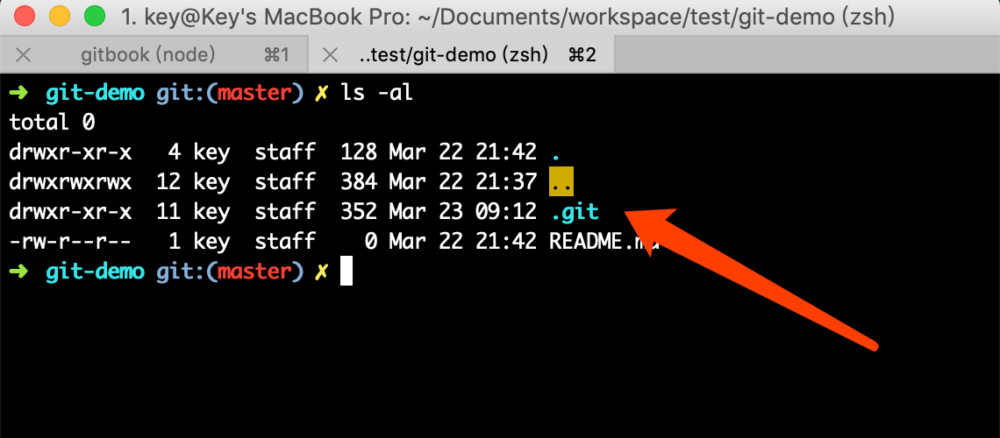

# Git 高效入门指南

:::tip
如果链接失效或者有其他问题，请联系牛马程序员金牌讲师--迈克尔.牛马，微信：Michael-Niuma
:::

## 2.2.工作区中.git 目录详解

以 git-demo 项目为例，进入到 git-demo 目录，通过 ls -al 命令查看里面内容



注意：如果是 windows 用户，命令行窗口不支持 ls -al 命令，可以安装 cmder 终端，这样体验会更好，效果如图：


cmder 下载地址：[http://edu.nodeing.com/group/1/thread/27](http://edu.nodeing.com/group/1/thread/27)

接下来，我们进入到.git 目录，分别介绍这个目录下的文件和文件夹的功能


```js
1.hooks文件夹,这个文件夹下存放一些shell脚本，可以设置一些特定的git命令
后触发相应的脚本，在搭建一些git托管系统的时候会用到

2.info文件夹，这里包含了一些git仓库信息

3.logs文件夹，保存所有更改的引用记录，继续打开logs文件夹，有refs文件夹和HEAD文件

4.objects文件夹,该目录存放所有的Git对象

5.refs/heads文件夹，存储本地所有分支文件

6.refs/tags文件夹，当给当前分支打上标签时，就会在tags文件夹下，生成对应文件

7.COMMIT_EDITMSG文件提交的是最近一次提交的描述信息

8.config文件，这个是GIt仓库的配置文件

9.description文件，仓库的描述信息

10.index文件，这个文件就是我们前面提到的暂存区（stage），是一个二进制文件

11.HEAD文件里面只存储了当前分支的关联
```
