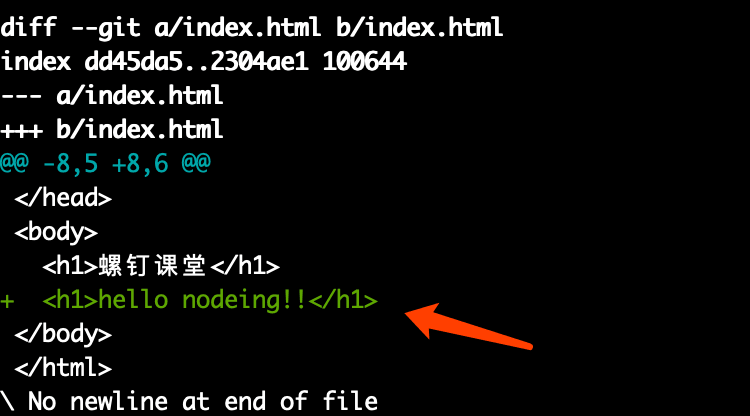
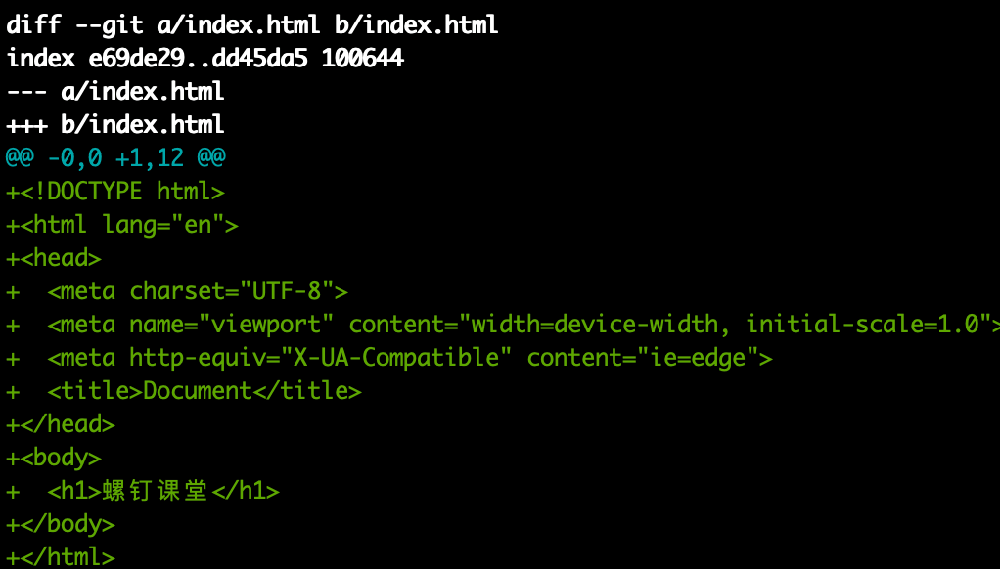

# Git 高效入门指南

:::tip
如果链接失效或者有其他问题，请联系牛马程序员金牌讲师--迈克尔.牛马，微信：Michael-Niuma
:::

## 2.4.常用 git 命令

### 2.4.1.回顾前面使用的命令

```js
1.git add  文件名   这个命令用来将代码提交到暂存区

2.git status  可以查看当前提交的状态

3.git commit -m '注释'  将代码从暂存区提交到版本库
```

### 2.4.2.查看日志

```js
git log
```

### 2.4.3.对比操作

经过第一次提交，版本库中的 index.html 是空文件，接下来我们开始写代码，在工作区 index.html 文件中写一点内容

```html
<!DOCTYPE html>
<html lang="en">
  <head>
    <meta charset="UTF-8" />
    <meta name="viewport" content="width=device-width, initial-scale=1.0" />
    <meta http-equiv="X-UA-Compatible" content="ie=edge" />
    <title>Document</title>
  </head>
  <body>
    <h1>螺钉课堂</h1>
  </body>
</html>
```

代码写好后，我们将代码提交到暂存区

```js
git add index.html
```

接下来，我们继续修改工作区中 index.html 的代码，增加一行代码

```html
<body>
  <h1>螺钉课堂</h1>
  <h1>hello nodeing!!!</h1>
</body>
```

经过上面步骤以后，工作区，暂存区，版本库中的 index.html 内容如图：


1.这个时候如果你想要对比查看工作区和暂存区的文件差异，可以使用下面的命令：

```js
git diff
```

结果如下：



其中，绿色字体部分表示工作区新增加的修改

2.如果你想要对比暂存区和版本库的差异，可以使用下面命令

```js
// 使用git diff --staged 也能达到一样的效果
git diff --cached
```

结果如下：



由于版本库中 index.html 是个空文件，此时，绿色部分全是增加的内容，意味着暂存区里面新增了多行代码

3.如果你想要对比工作区和版本库之间的差异，可以使用下面的命令

```js
git diff master
```

执行效果如下:


最后，我们把对比功能演示的代码提交到版本库

```js
git commit -m '第二次提交，对比功能演示完成'
```

### 2.4.4.撤销操作

接前面的操作，我们先把工作区中的修改提交到暂存区

```js
git add index.html
```

1.如果提交后，你觉得代码写错了，想要从暂存区撤销回工作区，可以执行下面命令：

```js
// git reset HEAD <file>
git reset HEAD index.html
```

2.如果想让工作区还原回上一次提交到版本库的状态，可以执行下面的命令：

```js
// git checkout -- <file>...
git checkout index.html
```

3.如果提交到版本库后发现当前的提交是有问题的，可以撤销回来，执行下面的命令：

```
git commit -m '注释' --amend
```

注意：这条命令会把上一次提交撤销然后合并本次提交

### 2.4.5.删除操作

1.工作区的文件可以随意删除

2.如果工作区的这个文件已经被提交到了暂存区，除了删除工作区文件外，还可以通过下面命令把暂存区文件也删除了

```js
// git rm 文件名
git rm test.html
```

注意：如果工作区中没有删除 test.html 这个文件，而直接执行上面的命令，是不能删除暂存区文件的

3.如果想同时删除暂存区和工作区文件，可以执行下面命令

```js
git rm -f test.html
```

4.如果只想删除暂存区文件，而保留工作区文件，可以执行下面命令

```
git rm --cached test.html
```

### 2.4.6.恢复操作

1.如果工作区中的 index.html 被删除掉了，这个时候想从版本库回复这个 index.html 文件，可以执行下面命令:

```
// 语法： git checkout 版本号 文件名
git checkout bf52d177b1cfd091db index.html
```

注意：上面命令中用到的版本号，可以通过 git log 打印出来获取到，如下图


2.如果想恢复多个文件，可以使用恢复整个版本的方式来实现，执行命令；

```js
// 语法：git reset --hard 版本号
git reset --hard  bf52d177b1cfd091db
```
