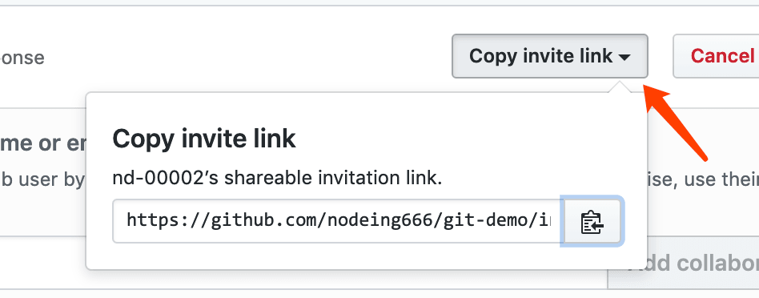

# Git 高效入门指南

:::tip
如果链接失效或者有其他问题，请联系牛马程序员金牌讲师--迈克尔.牛马，微信：Michael-Niuma
:::

## 3.2.设置项目的贡献者

一个项目如果多人参与，这个仓库的创建者需要去设置合作者，其他人才有权限参与到这个项目中，把代码同步到 github 上


在图中箭头 3 处的表单中，输入合作者的 github 名字，然后点添加


添加完成后，你可以把仓库地址分享给你的合作者：



注意：你的合作者需要点击你分享的这个链接，接受邀请才会有权限 push 代码到你创建的这个仓库

接下来，我们使用另一个合作者的账号(nd-00002)提交代码,nd-00002 拿到你分享的链接后做了以下操作：

1.克隆仓库

```
git clone https://github.com/nodeing666/git-demo.git
```

2.修改项目代码，在 index.html 增加一些样式

```js
<style>
  body{
    background-color: green;
  }
</style>
```

3.提交代码到暂存区

```js
git add index.html
```

4.提交代码到版本库

```
git commit -m '首页增加背景色'
```

5.把代码推送到远程仓库

```
git push origin master
```

nd-00002 这个同学经过这些操作后，你就可以在 github 仓库中查看到相应的 commit 信息了


