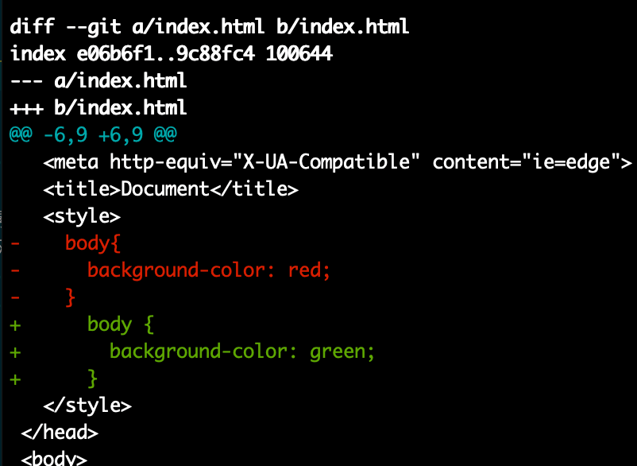
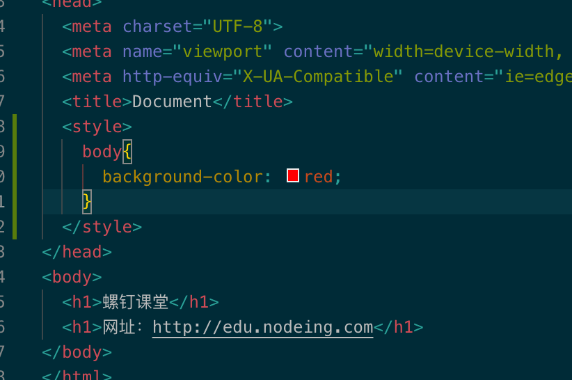

# Git 高效入门指南

:::tip
如果链接失效或者有其他问题，请联系牛马程序员金牌讲师--迈克尔.牛马，微信：Michael-Niuma
:::

## 3.3.解决冲突问题

1.在多人协作开发的项目中，每次开发之前每个人最好先同步更新一下 github 上最新的代码，可以减少冲突的概率

```
git pull
```

2.产生冲突

目前咱们演示项目 git-demo 中有两个开发这，第一个人，nodeing666，第二个，nd-00002，github 仓库中最新的代码是 nd-00002 这个人提交的代码，这个时候，如果 nodeing666 这个人在开发之前并没有拉取 github 中最新的代码，而是直接去修改 index.html 这个页面，例如：

```
<style>
  body{
    // nodeing666 修改了首页背景色
    background-color: red;
  }
</style>
```

代码写完后，nodeing666 把本地代码 push 到 github，此时是提交不上去的，效果如下：


3.解决冲突

第一步，产生冲突后，我们首先得去把远程仓库(origin/master)中的代码拉取下来，再去查看哪里产生冲突了,执行命令:

```js
git fetch
```

执行结果：


第二步，接下来，我们需要去对比本地 master 分支和远程仓库中的 master 分支

```
git diff master origin/master
```

执行结果：


第三步，手动把远程 master 分支和本地 master 分支合并

```js
git merge origin/master
```

执行后，index.html 页面中变成了这样：


此时，你需要取舍一下，当前冲突的代码到底保留什么，本次案例中，经过讨论，认为背景色保留为红色更好，因此，我们把 index.html 的代码修改成这样：



经过上一步手动修改代码，咱们已经解决好了冲突

第四步，重新提交代码并同步到远程仓库

```js
git add index.html
git commit -m '解决背景冲突问题'
git push origin master
```

执行结果：


