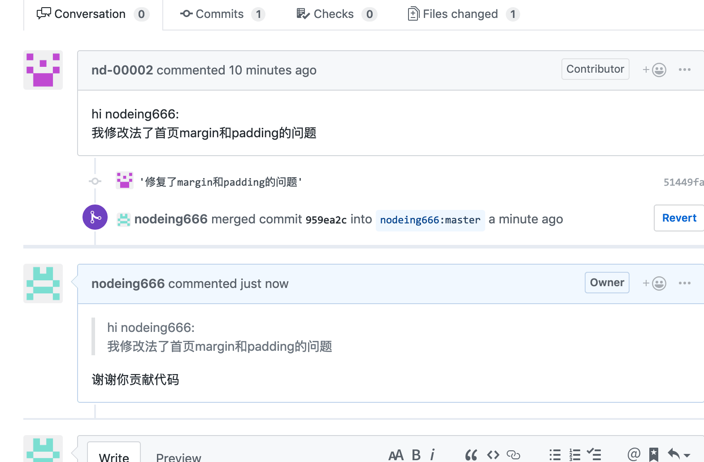

# Git 高效入门指南

:::tip
如果链接失效或者有其他问题，请联系牛马程序员金牌讲师--迈克尔.牛马，微信：Michael-Niuma
:::

## 3.4.开源协作

开源项目通常是没有写入的权限的，我们需要换一种协作方式参与到这些开源项目中

为了演示方便，我们把 git-demo 这个项目中 nd-00002 这个合作者的权限取消


接下来 nd-00002 这个人想参与到 git-demo 这个开源项目中项目中，需要做以下步骤：

第一步：fork 这个开源项目

fork 项目可以理解为克隆了一个版本放到了当前用户的名下


完成 fork 后，nd-00002 名下就有了 git-demo 这个开源项目


第二步，把 fork 过来的这个项目克隆到本地修改

```
git clone https://github.com/nd-00002/git-demo.git
```

第三步，修改克隆下来的项目，并且推送到 github 中

修改 index.html 文件，增加内容：

```html
<style>
  body {
    margin: 0;
    padding: 0;
    background-color: red;
  }
</style>
```

修改完成后，提交到版本库然后推送到 github, 具体过程此处省略

第四步，提交一个 pr(pull request)

在 github 中，nd-00002 账户下进行操作，首先进入到创建 pull request 的页面


进入 pull request 的页面后，点击创建


填入你要发送给项目作者的文字消息，点 Create pull request


完成后跳转到下面这个页面，到底位置 nd-00002 这个人参与 git-demo 项目的步骤完成了


第五步，项目作者审核 pr(pull request)

nodeing666 这个人是 git-demo 的作者，可以查看其他参与者发起的 pr


点击进入 nd-00002 提交的 pr


接下来确认 merge 代码


接下来，nodeing666 可以回复 nd-00002


到此为止，nd-00002 参与 nodeing666 这个人发起的开源项目，提交代码的过程完成：


