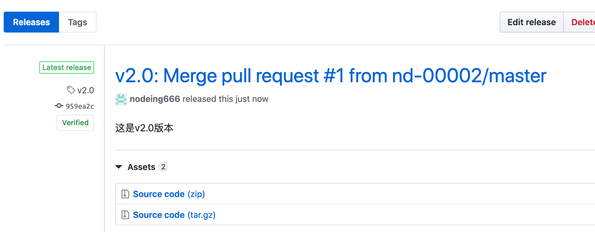

# Git 高效入门指南

:::tip
如果链接失效或者有其他问题，请联系牛马程序员金牌讲师--迈克尔.牛马，微信：Michael-Niuma
:::

## 5.1.标签的作用

给当前版本打一个标签，在 github 上就会形成一个 releases 版本


点击进去后，用户就可以下载对应版本的源代码


## 5.2.在本地 git 工具上创建标签，同步到 github

1.查看当前有多少标签

```
git tag
```

2.创建一个标签

```
git tag v1.0
```

3.把标签推送到 github

```
git push origin v1.0
```

推送完成后，我们去 github 查看结果：


## 5.3.直接在 github 上创建标签

1.点击进入版本发布页面


2.点击创建一个版本


3.填写相应的版本号和描述，点击发布


4.结果


