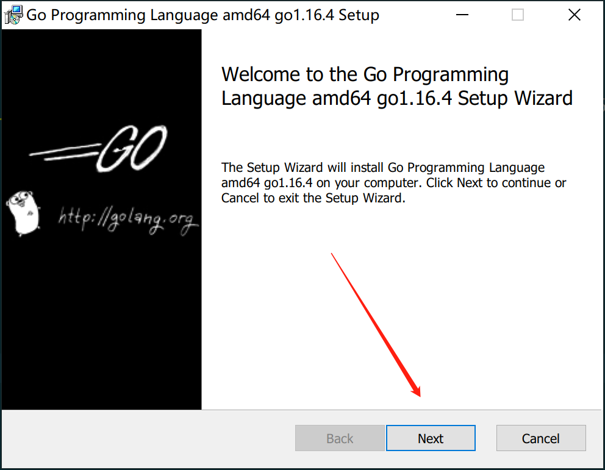
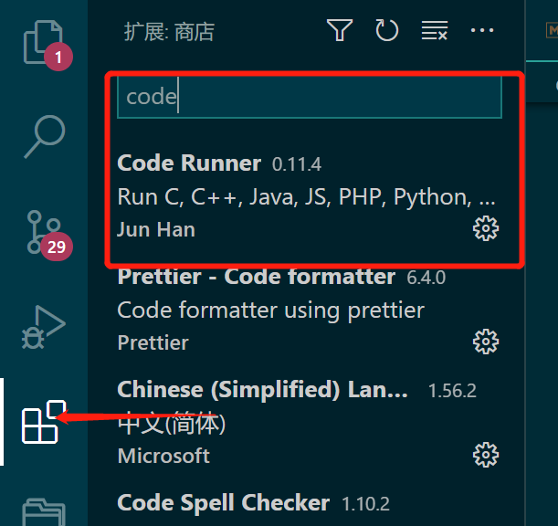

# helloworld

## 课程说明

::: tip

适合人群：本课程适合有一定编程基础的同学学习，你还需要具备一些基础的终端命令知识，知道什么是终端，如果不清楚这些基础命令，一定要加微信咨询，否则看不懂文档
答疑微信：nodeing-cn
:::

## 视频教程

百度云盘下载地址：

:::tip

链接: https://pan.baidu.com/s/15I4s2ZGFoZ4gkuyxl7Xkvw?pwd=f7t4 提取码: f7t4 复制这段内容后打开百度网盘手机 App，操作更方便哦
--来自百度网盘超级会员 v7 的分享

:::

## 环境安装

Golang 环境下载地址：[https://golang.org/dl/](https://golang.org/dl/)，说明一下，本文档写作的适合，最新版本为 1.16.4

目前，安装 Golang 的环境已经非常容易了，你只需要下载和自己系统相对应的版本，然后傻瓜式安装即可


安装过程，以 windows 为例：首先双击运行，注意：写文档的时候下载的最新版本是 1.16.4，所以下面截图和最新版本不一致，但不影响操作




等待安装完成即可，安装完成后，打开你的命令行工具输入命令检查是否安装成功

```go
go version
```


出现版本号说明说明 Golang 的命令已经可以用了，如果你输入命令后没有显示版本号，可能是因为环境变量没配置好，可以加微信 nodeing-com，帮你一对一指导

你也可以使用下面命令来查看环境相关的信息

```go
go env
```

我的电脑输出结果：

```go
set GO111MODULE=on
set GOARCH=amd64
set GOBIN=
set GOCACHE=C:\Users\Administrator\AppData\Local\go-build
set GOENV=C:\Users\Administrator\AppData\Roaming\go\env
set GOEXE=.exe
set GOFLAGS=
set GOHOSTARCH=amd64
set GOHOSTOS=windows
set GOINSECURE=
set GOMODCACHE=E:\workspace\go\pkg\mod
set GONOPROXY=
set GONOSUMDB=
set GOOS=windows
set GOPATH=E:\workspace\go
set GOPRIVATE=
set GOPROXY=https://goproxy.cn,direct
set GOROOT=C:\Program Files\Go
set GOSUMDB=sum.golang.org
set GOTMPDIR=
set GOTOOLDIR=C:\Program Files\Go\pkg\tool\windows_amd64
set GOVCS=
set GOVERSION=go1.16.4
set GCCGO=gccgo
set AR=ar
set CC=gcc
set CXX=g++
set CGO_ENABLED=1
set GOMOD=NUL
set CGO_CFLAGS=-g -O2
set CGO_CPPFLAGS=
set CGO_CXXFLAGS=-g -O2
set CGO_FFLAGS=-g -O2
set CGO_LDFLAGS=-g -O2
set PKG_CONFIG=pkg-config
set GOGCCFLAGS=-m64 -mthreads -fno-caret-diagnostics -Qunused-arguments -fmessage-length=0 -fdebug-prefix-map=C:\Users\Administrator\AppData\Local\Temp\go-build292707287=/tmp/go-build -gno-record-gcc-switches
```

通常情况下，Go 的安装包装好以后都会自动设置好环境变量, 这些配置你现在还没有必要去详细了解，我们先把基础语法学习了，等后面用到相关的配置，我们再回过头来看这里面的配置信息

## 动手实践

我们使用 vscode 来作为编写 Go 程序的工具，你需要安装一个扩展，方便我们编写 Go 程序代码


接下来，你可以在你电脑上任意位置创建你的 Go 项目，这得益于 Go Module 的推出，在 Go Module 推出之前，你必须把项目放到 GOPATH 目录下，这不是太灵活

我习惯把我的项目放到 GOPATH/src 目录下，因此，本套教程的源代码我还是会放到这个目录下来演示

这是我的演示目录 /e/workspace/go/go-demo，我们需要先初始化项目

第一步，打开命令行工具，进入到 go-demo 这个项目目录下，输入命令

```go
go mod init go-demo
```

第二步，输入命令，打开编辑器,开始编码

```go
code .
```

第三步，新建一个 main.go 的文件,编写代码

```go
package main

import "fmt"

func main() {
	fmt.Println("hello world")
}

```

第四步，运行代码，这里我们推荐最简便的方式，右键运行，但这需要你安装一个 vscode 的插件



安装 Code Runner 这个插件，安装好以后，你就可以通过 右键 --> Run Code 这种方式来运行你的代码了

结果如下：


下面我们来看一下 Code Runner 帮我们做了哪些事情，首先来观察一下输出的结果

```go
[Running] go run "e:\workspace\go\go-demo\main.go"
hello world
```

我们发现 Code Runner 调用了一个 go run 的命令来执行 main.go 这个文件，这实际上是 Go 自带的命令，另外，我们还可以手动的方式运行

第一步，先把 go 程序编译成 可以执行文件，以 windows 系统为例，可执行文件以 .exe 结尾

```go
// 运行命令
go build ./main.go
```

此时，你会发现项目目录下，生成了一个 main.exe 的可执行程序

第二步，执行这个 main.exe 的可执行程序

```go
./main.go  // 输出 hello world
```

编译运行 go 程序只需要两步，但是这在开发中会显得更麻烦，因此，你可以使用更为简单的命令

```go
go run ./main.go
```

go run 这个命令和 go build 这个命令的区别是，go run 并不会生成可执行文件，而是直接编译运行，这个时候你应该知道 Code Runner 帮我们做了哪些事情了，那就是直接帮我们去调用 go run 这个命令来运行 go 程序，到此为止，我们的第一个 go 程序已经跑起来了，欢迎进入 golang 的世界
